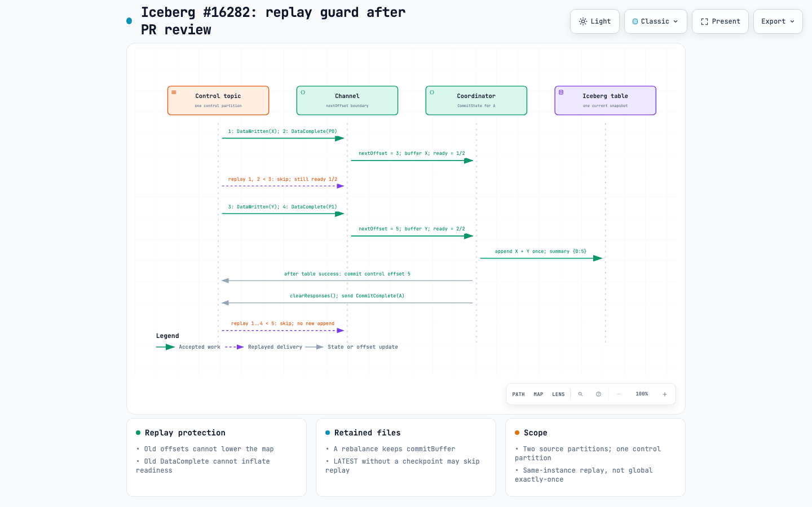

# Duplicate-File Replay Fix After PR Review

**The revised fix stops the same Kafka control record from being applied twice by a surviving channel.** This prevents replay from both inflating commit readiness and lowering the consumed-offset map. Buffered files remain available until the existing successful cleanup boundary.

This explains the local post-review implementation inspected on 2026-09-07. It replaces the reset-based explanation, not the historical files themselves, and does not claim that every scenario in issue #16282 is solved.

Interactive sequence: [iceberg-16282-duplicate-files-fix-after-pr-review.html](iceberg-16282-duplicate-files-fix-after-pr-review.html)



## What "Duplicate File" Means

A file appearing in snapshot S1 and a later snapshot S2 is normally expected: S2 can retain the same live file from S1. A query ordinarily scans its selected snapshot, not every historical snapshot.

The problematic case is **adding a file path again when the current snapshot already contains it**, so that one snapshot's live metadata references the same file twice. For an ordinary scan without other filtering/deletion effects, that can produce duplicate rows. The physical Parquet object need not be rewritten or copied.

The fix acts before another append is attempted. It does not add a global file-path uniqueness constraint to Iceberg or make a query engine deduplicate results.

## Three Different Offset Values

| Value | Where it lives | Meaning |
| --- | --- | --- |
| Kafka consumer position | Current consumer assignment | Where polling will continue; reassignment may rewind it |
| `controlTopicOffsets[partition]` | The channel's in-memory map | One past the highest accepted record offset for that partition |
| Committed control offset | Kafka consumer-group state | Durable resume position, written by the coordinator after table work succeeds |

The table snapshot also stores a control-offset summary used to filter already-committed file responses. It is distinct from the Kafka group checkpoint, even though their values coincide in the successful example below.

**Source partitions and control-topic partitions are different.** The sequence uses two source partitions, P0 and P1, to establish the expected readiness count. Their responses are delivered through a single control-topic partition, `0`.

## How Unguarded Replay Could Break the Commit

Before either proposed fix, the receive loop could dispatch a replayed record and unconditionally write its `offset + 1` into the map:

1. The buffer already contains file responses from higher offsets, while the map records a next offset such as `{0: 8}`.
2. Reassignment rewinds polling. Consuming only a replayed prefix can lower that map to something like `{0: 2}`.
3. A replayed `DataComplete` still carries the active commit ID. Counting it again can trigger a premature commit while the buffer includes responses beyond the regressed boundary.
4. The resulting snapshot can contain those files while advertising the lower offset boundary.
5. A later delivery of those higher-offset responses can pass the snapshot-offset filter and append an already-registered file again.

This is a causal illustration of the replay failure, not the literal event fixture used in the regression below. Within-batch `distinctByKey(ContentFile::location)` is not a cross-snapshot uniqueness check.

Relevant code: [Channel.java](../kafka-connect/kafka-connect/src/main/java/org/apache/iceberg/connect/channel/Channel.java#L119), [CommitState.java](../kafka-connect/kafka-connect/src/main/java/org/apache/iceberg/connect/channel/CommitState.java#L61), and [Coordinator.java](../kafka-connect/kafka-connect/src/main/java/org/apache/iceberg/connect/channel/Coordinator.java#L233).

## The Revised Rule

For each control record:

1. Find the stored next offset for **that record's partition**.
2. If the record offset is lower, skip the record before changing the map or dispatching the event.
3. Otherwise, store `record.offset() + 1`, then perform the existing decode and group-specific dispatch.

The matching-commit-ID check in `addReady` is still useful, but is not enough on its own: a replayed readiness event can have the *same* ID as the still-active round. The channel guard removes that duplicate delivery before `addReady` runs.

## Worked Example

Assume commit A is active, the Kafka group's committed control offset is `1`, and the coordinator expects responses covering source partitions P0 and P1. X and Y are distinct file paths for the same existing table and UUID.

| Delivery on control partition 0 | Guard action | Stored next offset | Buffered files | Ready count for A |
| --- | --- | ---: | --- | ---: |
| Offset 1: `DataWritten(X)` | Accept | 2 | X | 0/2 |
| Offset 2: `DataComplete(P0, A)` | Accept | 3 | X | 1/2 |
| Rebalance, then replay offset 1 | Skip: `1 < 3` | 3 | X | 1/2 |
| Replay offset 2 | Skip: `2 < 3` | 3 | X | 1/2 |
| Offset 3: `DataWritten(Y)` | Accept: `3 == 3` | 4 | X, Y | 1/2 |
| Offset 4: `DataComplete(P1, A)` | Accept | 5 | X, Y | 2/2 |

The last row shows the state that triggers the commit, before cleanup. The rebalance does **not** create commit B. The genuine P1 response completes the original commit A.

After the table work succeeds:

1. One new snapshot contains X and Y exactly once each, with the offset summary `{"0":5}`.
2. The coordinator commits Kafka control offset `5`.
3. It clears the file responses and publishes `CommitComplete(A)`.
4. `endCurrentCommit()` clears readiness and the active ID in `finally`.

The sequence collapses the per-table catalog/metadata work into the "Iceberg table" participant. It omits worker publishing and `StartCommit` setup, and the separate `CommitToTable` notification, to concentrate on the replay boundary. The arrow committing a control offset represents the consumer-group API, not another record appended to the control topic.

The regression deliberately seeks back again after the successful commit. Offsets `1` through `4` are all below the surviving boundary `5`, so none reaches the file buffer. A subsequent timeout cycle adds no new snapshot for those files. Such a seek is a test probe, not a claim that normal reassignment rewinds behind the now-committed offset `5`.

Source: `commitsReplayedFilesExactlyOnce` in [TestCoordinator.java](../kafka-connect/kafka-connect/src/test/java/org/apache/iceberg/connect/channel/TestCoordinator.java#L203).

## Why Reset Was Rejected

Resetting the buffer assumed that Kafka would deliver every discarded response again. That assumption fails in important cases:

- **No committed offset yet.** With the default `LATEST` policy, reassignment can start at the log end. A buffered file response might never be replayed to the surviving coordinator.
- **Partial replay across control partitions.** A timeout can commit after only one partition has replayed. Clearing all files while retaining the offset map can advertise progress for files that were discarded.
- **Retained assignment.** A partition that remains assigned need not rewind, so its discarded responses are not reconstructed.

The worker can already have advanced source offsets in the same transaction that published its responses. Simply expecting it to reread the source is not a recovery strategy.

The revised design retains both the buffer and the channel's progress. It does not change `auto.offset.reset`, flush offsets on revocation, or seek the consumer forward. The consumer may replay; the application declines to apply those records again.

**Preservation and duplicate suppression belong together.** Clearing the buffer while retaining this guard would cause the guard to suppress records needed to recover the lost buffer.

For the complete state and cleanup explanation, see [iceberg-commit-state-after-pr-review.md](iceberg-commit-state-after-pr-review.md).

## Why Only Keeping the Maximum Is Insufficient

Using `merge(partition, offset + 1, Long::max)` would prevent the map from moving backward, but would still call `receive` for replayed events. A duplicate `DataComplete` could still increase the readiness count. The new guard protects **both** the map and event dispatch.

This is the replay-guard approach discussed in [PR #17713](https://github.com/apache/iceberg/pull/17713). The monotonic-map approach in [PR #17933](https://github.com/apache/iceberg/pull/17933) addresses only the map side. Publication and consolidation are separate from this local implementation; these documents do not represent a maintainer decision or an issue-closure claim.

## What the Tests Cover

| Regression | Observable assertion |
| --- | --- |
| `commitsReplayedFilesExactlyOnce` | No premature commit; exact X/Y paths in one snapshot; matching notification snapshot ID; no extra snapshot after later replay |
| `retainsBufferedFilesWhenRebalanceResetsToLatest` | No committed offset; explicit log-end position after rebalance; retained file commits without replay |
| `retainsFilesDuringPartialControlReplay` | Both files persist across two control partitions, including retained assignment and delayed replay; table and Kafka offsets are checked |
| `ignoresReplayedOffsetsAndAcceptsNextOffset` | No duplicate dispatch or offset regression; equality with the next offset is accepted |
| `tracksPartitionsIndependentlyAndFiltersOtherGroups` | Independent partition progress and existing group filtering remain intact |

Sources: [TestCoordinator.java](../kafka-connect/kafka-connect/src/test/java/org/apache/iceberg/connect/channel/TestCoordinator.java#L143) and [TestChannel.java](../kafka-connect/kafka-connect/src/test/java/org/apache/iceberg/connect/channel/TestChannel.java#L43).

These test bodies use `MockConsumer` and the existing in-memory catalog. They were inspected, not rerun, during this documentation task. Prior red/green evidence and the implementation-session test results are recorded in [planning.md](../planning.md); diagram validation is not a Java test result or a live-broker reproduction.

## Boundaries

- The identity being suppressed is a **control-topic partition and offset**, not arbitrary business data or a file path.
- A new channel after process replacement does not inherit the old in-memory map or buffer. Durable-offset and restart recovery remain separate concerns.
- This does not establish correctness for competing coordinators, topic deletion/retention loss, or duplicate logical events republished at new offsets.
- Existing snapshot-offset filtering and within-batch path deduplication remain; neither is replaced by a new global uniqueness rule.
- The change prevents this same-instance replay path. It does not remove files already duplicated in table metadata.

## Artifact Evidence

Specification: [iceberg-16282-duplicate-files-fix-after-pr-review.sequence.json](iceberg-16282-duplicate-files-fix-after-pr-review.sequence.json)

Browser report: [iceberg-16282-duplicate-files-fix-after-pr-review.visual-check.json](iceberg-16282-duplicate-files-fix-after-pr-review.visual-check.json)

Screenshot contact sheet: [iceberg-16282-duplicate-files-fix-after-pr-review.visual-check.html](iceberg-16282-duplicate-files-fix-after-pr-review.visual-check.html)

### Delivery Receipt

```text
diagram_type: sequence
specification_sha256: 661eb9c333e70c01a623fd49196fcbaf809ec145aadbd83bbaeab6065559448a
specification_bytes: 3095
artifact_sha256: 789ca9c9c43ac463e67697effabc98cc0f6a771b7c24c59dc295f23784439f15
artifact_bytes: 708812
validation: 9/9 showcase, 0 errors, 0 warnings
browser_evidence: passed
visual_review: passed
correction_rounds: 2
```

Chrome measured no page overflow at 1440x900, 1600x1000, 1920x1080 and 2048x1320. An image-capable assistant inspected the artifact-bound light/dark screenshots at 1440x900 and 2048x1320: labels fit, delivery direction is clear, rows remain separate, and the final replay plus conclusion cards remain visible.

This is screenshot-based perceptual review of READ / Still mode, not human sign-off or exhaustive interaction/export testing. The automated report correctly retains `visualReview: pending`; the separate review statement above does not rewrite that machine receipt. Mobile containment was not measured.
