<!--
  Licensed to the Apache Software Foundation (ASF) under one
  or more contributor license agreements. See the NOTICE file
  distributed with this work for additional information
  regarding copyright ownership. The ASF licenses this file
  to you under the Apache License, Version 2.0 (the
  "License"); you may not use this file except in compliance
  with the License. You may obtain a copy of the License at

    http://www.apache.org/licenses/LICENSE-2.0

  Unless required by applicable law or agreed to in writing,
  software distributed under the License is distributed on an
  "AS IS" BASIS, WITHOUT WARRANTIES OR CONDITIONS OF ANY
  KIND, either express or implied. See the License for the
  specific language governing permissions and limitations
  under the License.
-->

# Kafka Connect → Iceberg: a source-guided architecture lesson

**The shortest explanation:** Kafka Connect tasks turn Kafka records into Iceberg data files. They transactionally publish descriptions of those files and source offsets to Kafka. An elected coordinator consumes those descriptions and commits the files into Iceberg table snapshots. A catalog publishes table state; `FileIO` reads and writes the physical files.

This tutorial teaches the implementation in this branch, with one four-partition `orders` example, embedded Mermaid diagrams, a local exercise, and failure/recovery walkthroughs. Both the **Iceberg REST Catalog API** and **reset/recovery behavior** are covered. Diagrams render in GitHub Markdown and Mermaid-enabled editors.

### Interactive companion: Iceberg Lab

Open [the offline Kafka → Iceberg simulator](example-kafka-connect-architecture-visualiger.html) in a browser. It starts with **five source partitions and two sink tasks**, both configurable. No Node.js server, Kafka cluster, or S3 account is required.

1. Click **Batch: 2 per partition**, then **Play** or **Next tick +1s**.
2. Watch records enter task writers and completed Parquet objects appear in the S3 dock.
3. Follow **Commit protocol** through Kafka handoff, manifest writes, REST publication, and coordinator checkpoint.
4. Open **S3 & Parquet** to inspect file rows and illustrative metadata contents.
5. Open **Snapshots & reader** to explore manifest references and historical reader-visible rows.
6. Try the timeout, task failure, coordinator restart, replay, and first-checkpoint-gap presets. Failures pause at a teaching boundary; resume the affected task or coordinator to continue.

The simulator models this checkout's replay guard and count-based readiness, not PR #17925's proposed expected-set check. Its expandable **Model boundaries** section documents deterministic scheduling, illustrative file encoding, assignment, and failure-injection simplifications. Parquet/Avro previews are logical representations rather than real generated binaries. The tutorial's four-partition example and simulator's configurable five-partition default use the same protocol.

## Contents

1. [Source version and learning goals](#1-source-version-and-learning-goals)
2. [Mental model: components and boundaries](#2-mental-model-components-and-boundaries)
3. [The running example](#3-the-running-example)
4. [Startup, assignment, and coordinator election](#4-startup-assignment-and-coordinator-election)
5. [One record becomes a file](#5-one-record-becomes-a-file)
6. [The commit protocol, step by step](#6-the-commit-protocol-step-by-step)
7. [Offsets and exactly-once delivery](#7-offsets-and-exactly-once-delivery)
8. [Iceberg REST Catalog API](#8-iceberg-rest-catalog-api)
9. [Iceberg files and reader visibility](#9-iceberg-files-and-reader-visibility)
10. [Class-by-class source tour](#10-class-by-class-source-tour)
11. [Timeouts, rebalances, restarts, and failure paths](#11-timeouts-rebalances-restarts-and-failure-paths)
12. [Resetting offsets and deliberate reprocessing](#12-resetting-offsets-and-deliberate-reprocessing)
13. [Local end-to-end exercise](#13-local-end-to-end-exercise)
14. [Debugging and verification](#14-debugging-and-verification)
15. [Student exercises and glossary](#15-student-exercises-and-glossary)

## 1. Source version and learning goals

### Repository provenance

| Item | Value at preparation, 2026-09-10 |
|---|---|
| Original repository | `apache/iceberg` |
| Fork | `nahidupa/iceberg-flink-primarykey-fix` |
| Working branch | `docs-connect-replay-review-notes` |
| Pre-rebase tip | `e6084b9eb` |
| Fetched upstream `main` | `0b1193cba1fac4fbe153e6b99b06bbb52e6c6b3b` |
| Post-rebase code tip | `967697c335282878d11fccc8fddbe1f1bba1cbf5` |
| Recovery branch | `backup/docs-connect-replay-review-notes-before-rebase-20260910` |

The branch was rebased onto the fetched upstream `main`; upstream ancestry was verified. Three branch commits were replayed. Test conflicts were resolved by preserving upstream offset tests and branch replay tests, with the upstream dispatch-count assertion adjusted for replay suppression. The rebased history is local; this work does not publish it to the fork.

The source links below are relative to this checkout. The commit IDs establish which implementation the explanation describes; “latest” is not a permanent version guarantee.

### What a student should be able to explain afterward

- Follow an order from a producer through a Kafka partition into a visible Iceberg snapshot.
- Explain why writing a file and committing a table are different operations.
- Identify which process owns each piece of state and which state survives a restart.
- Distinguish source offsets, control-topic offsets, and table snapshot progress.
- Read every class directly under the requested `connect/` and `connect/channel/` packages.
- Predict recovery for failures before and after the Kafka handoff and Iceberg commit.
- Inspect a running connector without mistaking low Kafka lag for completed Iceberg ingestion.

**Current versus historical material:** this branch also archives earlier reset-based proposals in `architecture/` and blog files. The current [Channel] implementation skips already-consumed physical control offsets while preserving in-memory state in a surviving channel. It has no custom control-rebalance reset callback and [CommitState] has no `reset()` method. Historical reset diagrams are not the current runtime design.

## 2. Mental model: components and boundaries

Think of a warehouse receiving parcels:

- **Kafka source topics:** an ordered delivery log, separately ordered within each partition.
- **Sink tasks:** packers that turn records into data files.
- **Control topic:** durable shipping paperwork describing completed files and progress.
- **Coordinator:** publishes those files into table snapshots.
- **Catalog:** the registry of table identities and current metadata.
- **Object storage/filesystem:** the actual shelves containing data and metadata files.

The analogy stops at transaction boundaries: Kafka and the catalog do not share one atomic transaction.

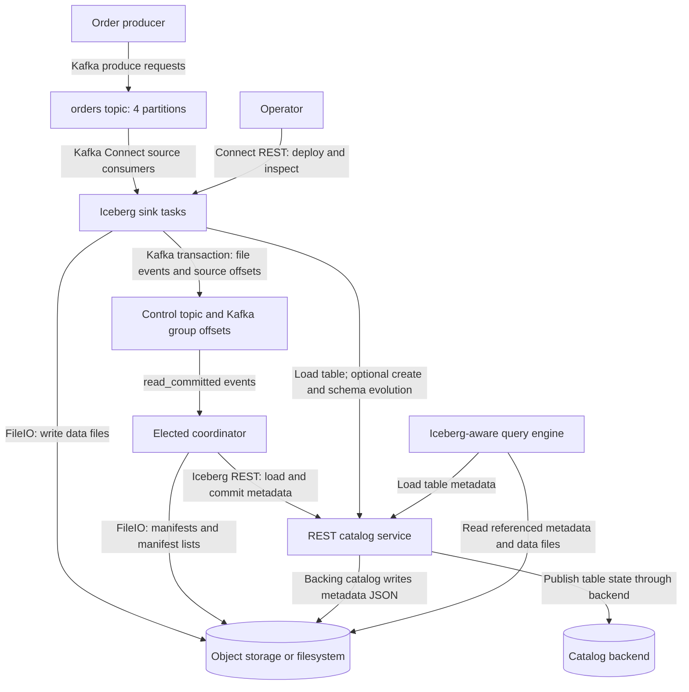

### Three interfaces that must not be confused

| Interface | Typical local endpoint | What crosses it |
|---|---|---|
| Kafka Connect management REST API | `http://localhost:8083` | Connector configurations, lifecycle requests, status |
| Iceberg REST Catalog API | `http://localhost:8181` | Catalog configuration, table metadata, commit requirements and updates |
| Storage API behind `FileIO` | MinIO `http://localhost:9000` in the example | Data files, manifests, manifest lists, table metadata JSON |

Ports are example deployment choices, not protocol requirements. The MinIO browser console is `9001`, not the S3 API port.

The connector does **not** send each row to an Iceberg REST “insert row” endpoint. It writes files directly through `FileIO`, then commits metadata references. Metadata files also live in storage: “metadata plane” does not mean all metadata bytes travel only over REST.

### Two meanings of “worker”

1. A **Kafka Connect worker process** is a JVM managed by Kafka Connect. It can host several connector tasks.
2. This connector's **`channel.Worker` object** belongs to a sink task. It writes through `SinkWriter` and polls control events when the task calls into it. It is not its own thread class.

The elected task additionally starts a **`CoordinatorThread`**. A two-task example does not require two JVMs, but two JVMs make process-failure demonstrations easier to isolate.

## 3. The running example

Assume an `orders` topic with four partitions and a single destination table, `sales.orders`.

```json
{"order_id":"O-100","customer_id":"C-7","amount":42.50,"region":"eu"}
```

The Kafka key is `O-100`; the JSON value contains the same identifier for the table. A key helps producer partitioning and ordering; it does **not** create a primary-key constraint in Iceberg. The exercise explicitly targets partitions for reproducibility.

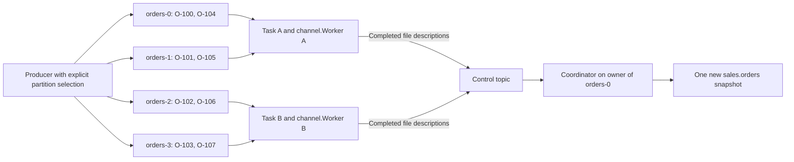

The assignment shown is illustrative. Kafka's assignor chooses the real assignment; task numbers and host placement can change. The coordinator is elected from ownership of the first assigned source topic-partition, not from a fixed task number.

Use these invented offsets for the conceptual walkthrough:

| Source partition | Records in this batch | Next offset handed off |
|---|---|---:|
| `orders-0` | 40, 41 | 42 |
| `orders-1` | 10 | 11 |
| `orders-2` | 7, 8 | 9 |
| `orders-3` | 20 | 21 |

Offsets are partition-local. Offset 40 on `orders-0` is not later than offset 20 on `orders-3` in a global order. A fresh local topic will normally start its application records at offset 0; the numbers above are teaching values, not expected lab output.

**Kafka partitions and Iceberg partitions solve different problems.** Kafka partitions divide ordered logs and consumer ownership. An Iceberg partition transform groups table rows for file organization and scan pruning. The example table is unpartitioned to isolate the protocol; four Kafka partitions do not require four Iceberg partitions or four output files.

## 4. Startup, assignment, and coordinator election

Read [IcebergSinkConnector], [IcebergSinkTask], [CommitterImpl], and [KafkaClientFactory] alongside this sequence.

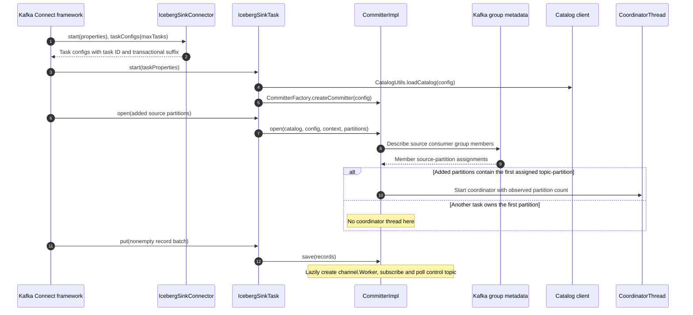

### Election algorithm

`CommitterImpl.findFirstTopicPartition()` takes the minimum across the source consumer group's assignments. `TopicPartitionComparator` sorts by topic name and then numeric partition ID. With only `orders`, the owner of `orders-0` is the leader. With several topics, lexical topic ordering also matters.

The coordinator captures `totalPartitionCount` from the group descriptions at construction. This is a **source-partition count**, not a worker/task count, and is not recomputed for each commit. Rebalances and stale assignment views are therefore important to understand; the response timeout prevents waiting forever for a complete response count.

### Groups and subscriptions

| Consumer or framework group | Example | Role |
|---|---|---|
| Connect cluster coordination group | `kc` in the Compose fixture | Coordinates Connect worker processes; not the sink source-offset group |
| Sink source consumer group | `connect-orders-sink` by default | Owns `orders` partitions; receives transactional source-offset commits |
| Each `channel.Worker` control consumer | `cg-control-<UUID>` | Independent transient group; each worker receives commit requests |
| Coordinator control consumer | `connect-orders-sink-coord` | Stable recovery group; checkpoints processed control offsets |

The Connect configuration/status/offset-storage topics are also distinct from the Iceberg control topic. Sink source consumer offsets are Kafka consumer-group offsets; do not assume they are the connector's control log or the Connect framework's configured offset-storage topic.

`Channel.start()` uses `subscribe()`, so internal control consumers are group-managed. `KafkaClientFactory` disables auto-commit and forces `read_committed`. If no usable checkpoint exists, their default reset policy is **`latest`**. A worker's transient control group never commits its consumed control offsets.

`Event.groupId` filters events for a connector. It is not the worker's random control-consumer group ID. If overriding the source consumer group, keep `iceberg.connect.group-id` consistent with the actual group used by Connect; election and connector event namespacing use that configuration.

## 5. One record becomes a file

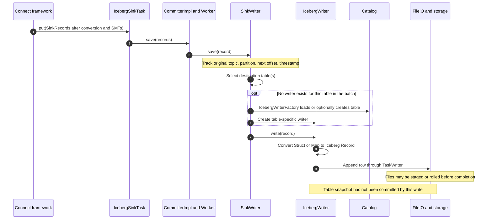

### What happens at each layer

1. **Connect conversion:** a converter turns Kafka bytes into Connect values. The normal path expects a `Struct` or `Map`. Single Message Transforms (SMTs), if configured, run before the sink receives records.
2. **Offset tracking:** [SinkWriter] stores `originalKafkaOffset() + 1` using the original topic and partition. Topic-rewriting SMTs must not cause offsets to be committed for a made-up destination topic.
3. **Routing:** without a route field, static routing sends each record to every configured table. Regex routing can select several tables. Dynamic routing derives a lowercased table identifier from a value field.
4. **Table/writer creation:** [IcebergWriterFactory] loads the table. Optional auto-create uses the sample record's schema or inferred shape. Writer instances are cached per table for the current write batch.
5. **Conversion:** [RecordConverter] maps values to table fields and types. Schema evolution, when enabled, can complete the current writer, update table schema, and start another writer.
6. **Physical writing:** [RecordUtils] builds a `GenericFileWriterFactory`, `OutputFileFactory`, and either `UnpartitionedWriter` or [PartitionedAppendWriter]. The writer uses `table.io()`.
7. **Completion:** [IcebergWriter] completes its `TaskWriter` and produces file descriptors. It does not publish the data-file snapshot itself.

`DataFile` means a descriptor containing location, size, record count, partition information, and metrics—not the file's bytes. The coordinator can commit the file without receiving every row over Kafka again.

The target file size is a rolling target, not a promise. A commit request completes currently open writers even if their files are small. More tasks, more Iceberg partitions, and shorter commit intervals can all increase small-file counts.

**Identifier fields are not upsert implementation.** Although `RecordUtils` configures equality-field information when ID columns exist, this checkout selects append writers for the normal path. Null values are ignored by `IcebergWriter.write()`. A Kafka tombstone therefore does not automatically delete an Iceberg row, and a repeated `order_id` does not automatically replace an earlier row.

## 6. The commit protocol, step by step

### Event vocabulary

Events are defined in the separate [events module][events]. [AvroUtil] encodes them for the control topic.

| Payload | Sender → receiver | Meaning |
|---|---|---|
| `StartCommit` | Coordinator → workers | Complete current writes for this commit UUID |
| `DataWritten` | Worker → coordinator | Table identity and completed data/delete file descriptions |
| `DataComplete` | Worker → coordinator | Response complete; includes all assigned source partitions and available progress |
| `CommitToTable` | Coordinator → observers | One table snapshot was committed |
| `CommitComplete` | Coordinator → observers | Coordinator cycle reached its completion path |

The outer `Event` carries an event UUID, timestamp, group ID, payload type, and payload. The commit UUID correlates a cycle; it is different from the event UUID and the Iceberg snapshot ID.

### Happy path: both tasks respond

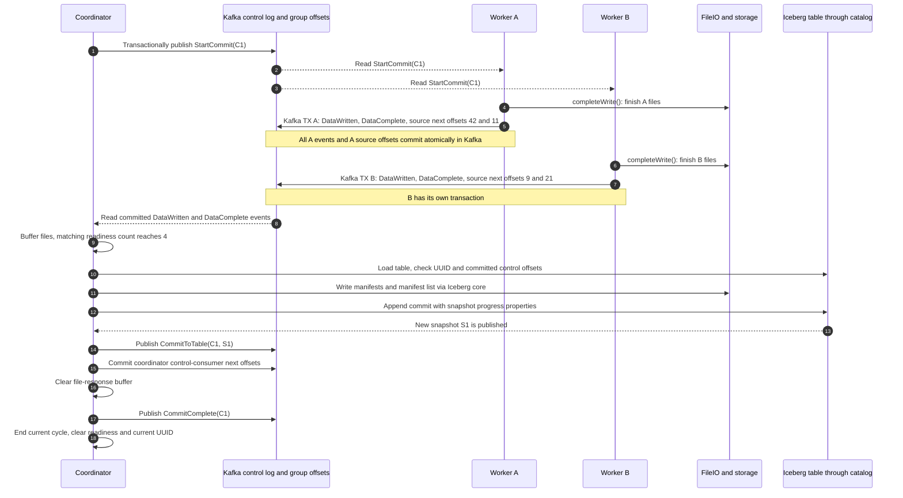

The order shown between A and B is illustrative. Each producer keys its control records by its producer UUID to preserve its own event ordering. A multi-partition control topic has no global ordering across producers.

### Detailed interpretation

1. `Coordinator.process()` checks the interval and calls `CommitState.startNewCommit()`. It sends `StartCommit` with a new UUID.
2. An active worker polls that event during `Worker.process()`. `SinkWriter.completeWrite()` completes writers, copies source offsets, then clears its writer and source-offset maps for the next batch.
3. The worker constructs zero or more `DataWritten` messages and one `DataComplete`. Even assigned source partitions with no new records are listed, with null offset/timestamp values.
4. `Channel.send()` starts a Kafka producer transaction, sends the events, adds source offsets with the **actual source consumer group metadata**, and commits. On an exception it attempts an abort and rethrows.
5. The coordinator buffers `DataWritten` responses. It accepts older-cycle file responses for recovery. A `DataComplete` contributes to readiness only if its commit UUID matches the active cycle.
6. Readiness adds each matching response's **assignment-list size**. It is a count, not a set that deduplicates source partitions. Suppressing repeated physical control records before dispatch matters.
7. `commitToTable()` loads the table, checks its UUID, selects the configured branch, filters already committed control offsets, removes empty files, and deduplicates file locations within the candidate batch.
8. Without delete files it calls `newAppend()`; with delete files it uses `newRowDelta()`. Both attach connector progress to the snapshot and use a snapshot-ancestry validator.
9. Table jobs may run in parallel. When they all return successfully, the coordinator checkpoints control offsets, clears file responses, and sends `CommitComplete`.
10. A `finally` block ends the active cycle. Ending readiness and clearing file responses are deliberately separate operations.

### Timing and reader visibility

The following is a constructed teaching timeline, using a 10-second commit interval and a 5-second response timeout. It is not a measured latency guarantee.

| Relative time | Action | Source offsets | Reader sees new rows? |
|---|---|---|---|
| `t=0` | First coordinator interval check establishes timer | Previous checkpoint | No |
| `t=1..9` | Tasks receive records and write/stage files | Previous checkpoint | No |
| `t≈10` | Coordinator sends `StartCommit` | Previous checkpoint | No |
| `t≈10.2` | A completes Kafka handoff | A advances to 42/11 | No |
| `t≈10.4` | B completes Kafka handoff | B advances to 9/21 | No |
| `t≈10.8` | Table snapshot publishes | Already advanced | Yes, after reader refresh/planning |
| `t≈10.9` | Coordinator checkpoints control offsets | Unchanged | Yes |
| `t≈11` | Completion notification | Unchanged | Yes |

`flush()` is not “force an Iceberg snapshot now”: `IcebergSinkTask.flush()` calls `committer.save(null)` to service control processing. `preCommit()` returns an empty map because the worker handles source-offset commits. Lowering Kafka Connect's framework offset-flush interval alone does not replace the Iceberg coordinator's commit interval.

## 7. Offsets and exactly-once delivery

### Three durable progress markers, plus two local caches

| State | Where it lives | What it means | Survives a new instance? |
|---|---|---|---|
| Source consumer next offsets | Kafka consumer-group offsets | File events for that source progress have been transactionally handed off | Yes, while retained |
| Coordinator control next offsets | Kafka group `connect-orders-sink-coord` | Coordinator checkpoint after table processing | Yes, while retained |
| Per-table control next offsets | Iceberg snapshot summary | Control responses already incorporated into this table's ancestry | Yes, while relevant history remains |
| `Channel.controlTopicOffsets` | Java map | Highest next control offset consumed per partition in this instance | No |
| `Channel.committedOffsets` | Java map | Last successfully checkpointed control offset in this instance | No |

The snapshot property name is:

```text
kafka.connect.offsets.<control-topic>.<connect-group>
```

For this example:

```text
kafka.connect.offsets.control-orders.connect-orders-sink
```

Its JSON value maps **control-topic partition IDs** to next offsets. It does not map `orders` source partitions to source offsets. Other snapshot summary properties include `kafka.connect.commit-id`, `kafka.connect.task-id`, and sometimes `kafka.connect.valid-through-ts`.

### Worked replay calculation

Suppose a `DataWritten` event for file A arrives at control partition 0, record offset 100. The next-offset watermark becomes 101. A following `DataComplete` at offset 101 makes it 102.

| Incoming physical control record | Local next watermark before record | Action |
|---|---:|---|
| partition 0, offset 100 | absent | Dispatch; watermark → 101 |
| partition 0, offset 101 | 101 | Dispatch; watermark → 102 |
| partition 0, replayed offset 100 | 102 | Skip before decoding/dispatch |
| partition 0, replayed offset 101 | 102 | Skip |
| partition 0, offset 102 | 102 | Accept; watermark → 103 |
| partition 1, offset 0 | absent for partition 1 | Accept independently |

For a **new coordinator instance**, the local map is empty. If it replays offset 100, it can buffer the event again. If the table's last connector snapshot stored control partition 0 → 102, `commitToTable()` rejects that old file response because `100 < 102`. If the table was not committed, the response remains eligible.

### What the combined protections accomplish

1. **Transactional handoff:** worker file events and its source offsets are atomic in Kafka. Internal consumers use `read_committed`.
2. **Live-instance replay suppression:** the branch guard skips lower physical offsets before they can duplicate readiness or file responses.
3. **Monotonic local control progress:** upstream's `Long::max` merge retains the highest consumed position.
4. **Non-increasing checkpoint suppression:** upstream's committed-offset cache avoids repeating or lowering this instance's checkpoint.
5. **Per-table durable replay filtering:** snapshot control offsets prevent reapplying an already committed table response after restart.
6. **Concurrency validation:** snapshot ancestry must still contain the expected connector offsets when the table commit validates. Another coordinator's progress can invalidate a stale commit.

The local committed-offset cache is not a global fence between two coordinator instances; `Channel` explicitly notes that overlapping coordinators can overwrite one another's Kafka offsets. Per-table validation and replay filtering are separate protections.

### Exactly-once is not business-key deduplication

The connector documents exactly-once delivery, relying on Kafka transactions/KIP-447 and Iceberg commit bookkeeping. Interpret that within the protocol: repeated recovery of the same durable file response should not add its files again.

It does not mean:

- Kafka and Iceberg commit atomically together.
- Several destination tables change in one atomic transaction.
- Two distinct Kafka records with the same `order_id` produce one row.
- Manually rewinding source offsets into an existing append table is idempotent.
- Deleted control history or lost catalog metadata can be reconstructed by an in-memory map.

## 8. Iceberg REST Catalog API

### Configuration becomes a catalog client

Follow [CatalogUtils] → [CatalogUtil] → [RESTCatalog] → [RESTSessionCatalog].

`IcebergSinkConfig` strips the `iceberg.catalog.` prefix before passing catalog properties to Iceberg. `CatalogUtil.buildIcebergCatalog()` selects `RESTCatalog` for `type=rest`.

| Connector property | Meaning |
|---|---|
| `iceberg.catalog` | Local client-side catalog name; default `iceberg` |
| `iceberg.catalog.type=rest` | Select the REST catalog implementation |
| `iceberg.catalog.uri` | Catalog HTTP service base URI |
| `iceberg.catalog.warehouse` | Server-defined warehouse identifier or location; not always an S3 path |
| `iceberg.catalog.io-impl` | FileIO implementation, for example `S3FileIO` |
| `iceberg.catalog.s3.endpoint` | S3-compatible storage endpoint, not the REST catalog endpoint |

REST initialization fetches `/v1/config` and merges **server defaults → client properties → server overrides**. Table loading can supply table-specific configuration and storage credentials. Catalog authentication and object-storage authorization are distinct even when the catalog vends credentials.

### Important endpoints

The contract is [rest-catalog-open-api.yaml][rest-spec]; URL construction is in [ResourcePaths]. In the table below, `{prefix}` is optional server configuration. Omit that segment when none is configured. Multi-level namespaces require the spec's encoding; do not turn every dot into `/`.

| Method and resource | Purpose |
|---|---|
| `GET /v1/config` | Bootstrap configuration and advertised capabilities |
| `GET/POST /v1/{prefix}/namespaces` | List/create namespaces |
| `GET/POST /v1/{prefix}/namespaces/{namespace}/tables` | List/create tables |
| `GET /v1/{prefix}/namespaces/{namespace}/tables/{table}` | Load a table's metadata and configuration |
| `POST /v1/{prefix}/namespaces/{namespace}/tables/{table}` | Commit table requirements and updates |
| `GET .../tables/{table}/credentials` | Obtain storage credentials where supported |
| `POST /v1/{prefix}/transactions/commit` | API for an atomic multi-table commit; not used by this coordinator's fan-out path |

### How a file append becomes a REST commit

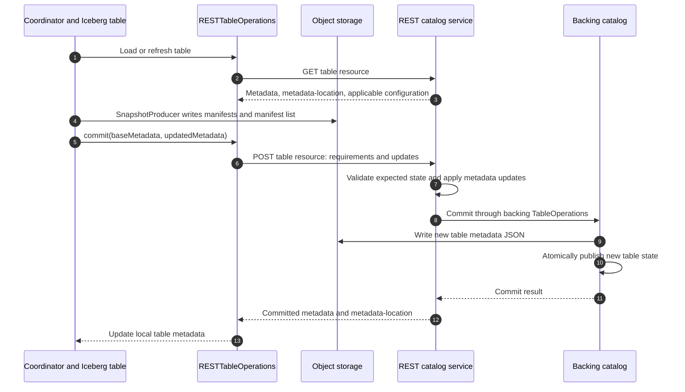

The server-side path shown is the repository's [CatalogHandlers] adapter and a metastore-backed catalog such as [JdbcTableOperations]. A different REST service may use a different backend, but must implement the REST contract. Iceberg includes the client, contract, handlers, and test fixture; deploying a catalog service is still a separate operational component.

[SnapshotProducer] prepares snapshot metadata and calls table operations. [RESTTableOperations] computes structured **requirements** (assertions about expected state) and **updates** (metadata deltas). For example, a request can assert the expected snapshot for a ref, add a snapshot that points to a manifest list, and advance the ref.

The following is deliberately abbreviated **pseudocode**, not a runnable JSON request:

```text
requirements:
  assert the expected table UUID and/or ref snapshot state as generated for this update
updates:
  add-snapshot(snapshot ID, manifest-list location, summary, ...)
  set-snapshot-ref(main, new snapshot ID, ...)
```

The request contains metadata changes, not Parquet bytes. The server validates requirements and uses a metadata builder/backing catalog commit. For a JDBC backend, publication includes a conditional metadata-location update. A conflict can return HTTP 409; a lost response or certain server errors can mean **unknown commit state**, not proof that nothing happened.

This checkout has a limited reconciliation path for qualifying SIMPLE snapshot-add updates: refresh and look for the expected snapshot. It does not cover arbitrary updates or non-main ref changes. If reconciliation cannot establish success, the unknown-state exception propagates.

## 9. Iceberg files and reader visibility

Iceberg is a **table format**, not a new filesystem. It can use object storage or a filesystem through `FileIO`. The catalog finds the current table state; metadata determines which files belong to a snapshot.

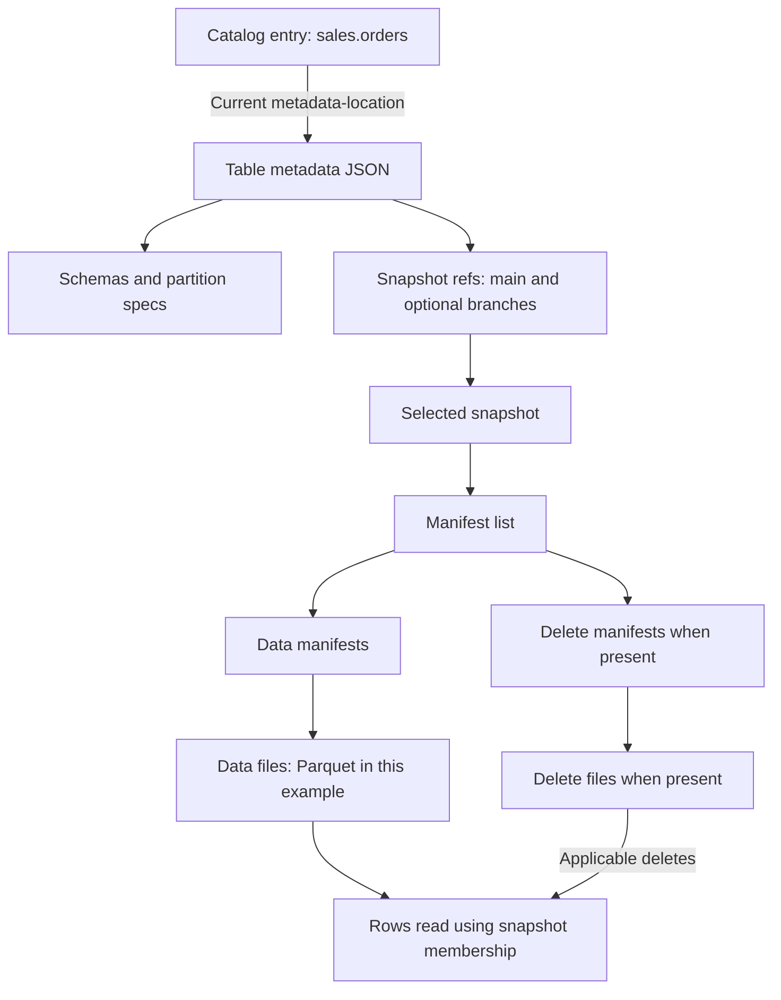

### File anatomy

| Artifact | Contains | Typical writer in this path |
|---|---|---|
| Data file | Encoded table rows | Sink task's `TaskWriter` via `FileIO` |
| Delete file, if present | Row deletion information | A delete-capable writer; not inferred merely from this append example |
| Manifest | File entries, partition information and metrics | Iceberg snapshot-building code in coordinator |
| Manifest list | Manifest references and summary information | Iceberg snapshot-building code in coordinator |
| Table metadata JSON | Schemas, specs, properties, snapshots, refs, history | Backing catalog table operations during REST commit |
| Catalog entry | Table identity and current metadata state/location | Catalog backend |

A typical **format-v2** layout might look like this:

```text
catalog backend: sales.orders → s3://bucket/warehouse/sales/orders/metadata/00002-....metadata.json

s3://bucket/warehouse/sales/orders/
├── data/
│   ├── <unique-A>.parquet
│   └── <unique-B>.parquet
└── metadata/
    ├── 00001-<uuid>.metadata.json
    ├── 00002-<uuid>.metadata.json
    ├── snap-<snapshot-id>-<attempt>-<uuid>.avro   # manifest list
    ├── <uuid>-m0.avro                          # manifest
    └── <uuid>-m1.avro
```

This is an illustrative layout, not a path to hardcode. Catalog-generated locations, `write.data.path`, `write.metadata.path`, object-storage hashing, and custom location providers can alter it. S3 directories are object-key prefixes. Follow locations returned in metadata rather than guessing names.

The broader source supports format-v4 Parquet manifests; “every Iceberg manifest is Avro” is not universally true. The example deliberately uses format v2. See the [format specification][format-spec] and [LocationProviders].

### Why a reader cannot just list the data directory

Suppose A's file exists but the REST commit has not published snapshot S1. A reader using the previous snapshot must not include that file. It may be an in-progress write, an abandoned attempt, or a file intended for another branch.

Once S1 is published, a reader that refreshes and plans against S1 follows its metadata chain. Readers already using an older snapshot can continue using it. A snapshot is not a copied directory of all rows; it can reuse existing manifests and files.

Maintenance is a separate lifecycle: snapshot expiration and orphan-file cleanup are not performed by this connector's normal commit loop. An unreferenced file is not necessarily safe to delete immediately—it might still be described by a pending control event. Recovery windows and metadata/control-log retention must be considered together.

## 10. Class-by-class source tour

The two requested directories contain seven top-level connector types and ten top-level channel types. The tables link to each file; method names provide stable search targets without relying on shifting line numbers.

### 10.1 Connector-facing package

Base directory: `kafka-connect/kafka-connect/src/main/java/org/apache/iceberg/connect/`.

| Class | Responsibility, methods, and role in the example |
|---|---|
| [IcebergSinkConnector] | Framework entry point. `start()` retains properties; `taskClass()` selects `IcebergSinkTask`; `taskConfigs()` creates task-specific IDs and transactional suffixes. It describes A/B tasks but does not consume orders or elect the coordinator. `config()` exposes the configuration definition; `stop()` is empty. |
| [IcebergSinkTask] | Adapts Connect lifecycle calls to connector logic. `start()` sets environment metadata and creates config/catalog/committer. `open()` and `close()` forward assignments. `put()` forwards records, `flush()` services the committer, `preCommit()` returns an empty map, and `stop()` closes resources. Its fields are task-scoped. |
| [IcebergSinkConfig] | Defines, validates and resolves properties. Separates catalog, Kafka, Hadoop, auto-create and writer settings; caches `tableConfig()` results. `connectGroupId()` normally derives `connect-<name>`. The example's interval and timeout are read here. Worker Kafka properties are discovered when possible, then explicit `iceberg.kafka.*` overrides apply. |
| [TableSinkConfig] | Resolved per-table settings holder: `routeRegex()`, `idColumns()`, `partitionBy()`, `commitBranch()`. It tells the writer/coordinator how `sales.orders` differs from defaults; it does not hold a table commit or enforce uniqueness. |
| [CatalogUtils] | `loadCatalog()` calls `CatalogUtil.buildIcebergCatalog()` with stripped catalog properties and optional Hadoop configuration. `loadHadoopConfig()` uses reflective loading so the connector can work without mandatory Hadoop classes. This is where the example selects REST. |
| [Committer] | Lifecycle/write interface connecting task callbacks to coordination. `open()`, `close()`, and `save()` are the key contract. Compatibility defaults bridge deprecated lifecycle methods; new code should follow the current task callbacks. |
| [CommitterFactory] | `createCommitter()` currently returns `CommitterImpl`. It is an indirection point, not a configuration-driven selection among several protocols. |

### 10.2 Channel package

Base directory: `kafka-connect/kafka-connect/src/main/java/org/apache/iceberg/connect/channel/`.

| Class | Responsibility, methods, state ownership |
|---|---|
| [CommitterImpl] | One per task. Owns a lazy `Worker`, optional `CoordinatorThread`, configuration, catalog and context. `open()` initializes/elects; `save()` starts/writes/polls; `close()` stops writing state and handles coordinator ownership/offset seeking. `processControlEvents()` detects a dead coordinator. Nested `TopicPartitionComparator` implements the election ordering. |
| [Channel] | Base transport shared by worker and coordinator. Owns transactional producer, subscribed consumer, Admin client, producer key, consumed high-water map and committed-offset cache. `send()` handles Avro/Kafka transactions; `consumeAvailable()` polls, suppresses physical replay, tracks progress, filters group and calls `receive()`. `commitConsumerOffsets()` checkpoints only locally increasing offsets. `start()` subscribes/polls; `stop()` closes clients. |
| [Worker] | One active writer participant per task. Owns `SinkWriter` and Connect context. `save()` writes records; `process()` polls without a long wait. `receive(START_COMMIT)` finishes files and sends events plus source offsets in one transaction. `stop()` closes channel and writer. It does not wait for `CommitComplete` to advance source offsets. |
| [Coordinator] | Owns the cross-task commit loop, captured source-partition count, executor, `CommitState`, failure counters and snapshot-property namespace. `process()` initiates/times out cycles; `receive()` handles responses/readiness; `commit()` applies cycle-level failure policy; `doCommit()` runs table jobs and checkpoints; `commitToTable()` validates and commits files. `lastCommittedOffsetsForTable()` searches ancestry; `offsetValidator()` detects stale progress. |
| [CommitState] | In-memory file-response buffer, readiness list/count, current UUID, and start time. `addResponse()` retains files across cycles; `addReady()` counts matching-cycle assignments. `startNewCommit()`, `isCommitReady()`, and timer methods control a cycle. `endCurrentCommit()` clears readiness/UUID; `clearResponses()` separately clears files. `tableCommitMap()` groups responses by table identity. |
| [CoordinatorThread] | Dedicated thread calling coordinator `start()`, repeated `process()`, and `stop()`. Termination is observable by the task. `terminate()` requests termination and shuts down table-commit execution through the coordinator. It does not implement a supervisor that restarts failed tasks. |
| [KafkaClientFactory] | Builds internal producer/consumer/Admin clients. Producers get transactional IDs and `initTransactions()`. Consumers get their own groups, `read_committed`, disabled auto-commit and default `latest`. These are internal control clients, distinct from Connect's source consumer. |
| [KafkaUtils] | `consumerGroupDescription()` uses Admin for membership. `consumerGroupMetadata()` obtains the real source consumer generation metadata for transactions. `seekToLastCommittedOffsets()` rewinds currently assigned source partitions where committed offsets exist. Access uses reflection into `WorkerSinkTaskContext.consumer`; failures surface as `ConnectException`. |
| [Envelope] | Couples decoded `Event` with its physical control partition and record offset. Its `offset()` is the actual record offset, not the next-offset checkpoint. This is the evidence used for per-table replay filtering. |
| [NotRunningException] | Runtime failure raised when `CommitterImpl` discovers unexpected coordinator termination. This makes a coordinator failure visible to the task instead of silently continuing to write indefinitely. |

### 10.3 Supporting data package

| Class | Why it matters |
|---|---|
| [SinkWriter] | Routes records, caches table writers, tracks original source offsets, and aggregates `completeWrite()` results. |
| [IcebergWriterFactory] | Loads/auto-creates tables and chooses a real writer or `NoOpWriter` for allowed missing dynamic targets. |
| [RecordWriter] | Common `write`, `complete`, and `close` contract for table writers. |
| [IcebergWriter] | Converts values, manages schema changes and task-writer completion, returns file descriptors. |
| [NoOpWriter] | Intentionally ignores records for a missing dynamic target when auto-create is disabled. |
| [RecordConverter] | Converts Connect Struct/Map fields into Iceberg values; handles field lookup, name mapping, type conversion and schema-update collection. |
| [RecordUtils] | Extracts routing fields and builds file/writer factories and append writers. |
| [SchemaUtils] | Converts/infers schemas, builds partition specs, and supports schema updates. |
| [SchemaUpdate] | Represents collected schema changes used during conversion/evolution. |
| [PartitionedAppendWriter] | Routes Iceberg rows by the table's partition spec to append writers. |
| [Offset] | Source next-offset plus record timestamp; `NULL_OFFSET` represents no progress for an assigned partition. |
| [IcebergWriterResult] | Completed file results and table/partition information for one table writer. |
| [SinkWriterResult] | Aggregated writer results plus the source-offset map used for the Kafka handoff. |

### 10.4 Supporting event types

Besides the five payloads in section 6, inspect [events] for `Payload`, `PayloadType`, `Event`, `TableReference`, `TopicPartitionOffset`, and `AvroUtil`. `TableReference` includes a table identifier and can carry its UUID, preventing old files from being attached to a newly created table that happens to reuse a name. `TopicPartitionOffset` describes **source** assignment progress inside `DataComplete`; `Envelope` describes the **control** record carrying an event.

## 11. Timeouts, rebalances, restarts, and failure paths

### 11.1 Several clocks, not one timeout

| Clock/property | What it controls |
|---|---|
| `iceberg.control.commit.interval-ms` | Time between coordinator cycle starts when no cycle is active; default 300,000 ms |
| `iceberg.control.commit.timeout-ms` | Waiting for response readiness before attempting a partial commit; default 30,000 ms |
| Kafka producer transaction timeout | Broker/client transaction lifetime; separate from Iceberg response timeout |
| Source consumer poll/session settings | Liveness and assignment; may trigger source rebalances |
| Internal control consumer poll/session settings | Control-group liveness; may trigger control rebalances |
| REST/storage request and Iceberg retry settings | Individual requests or metadata commit retries |

The commit response timeout is checked in `Coordinator.process()` after polling. It is not a hard deadline interrupting a blocked REST call or storage upload. Likewise, the one-second coordinator poll interval and task scheduling can shift observed timing.

### 11.2 Slow worker: partial commit followed by late recovery

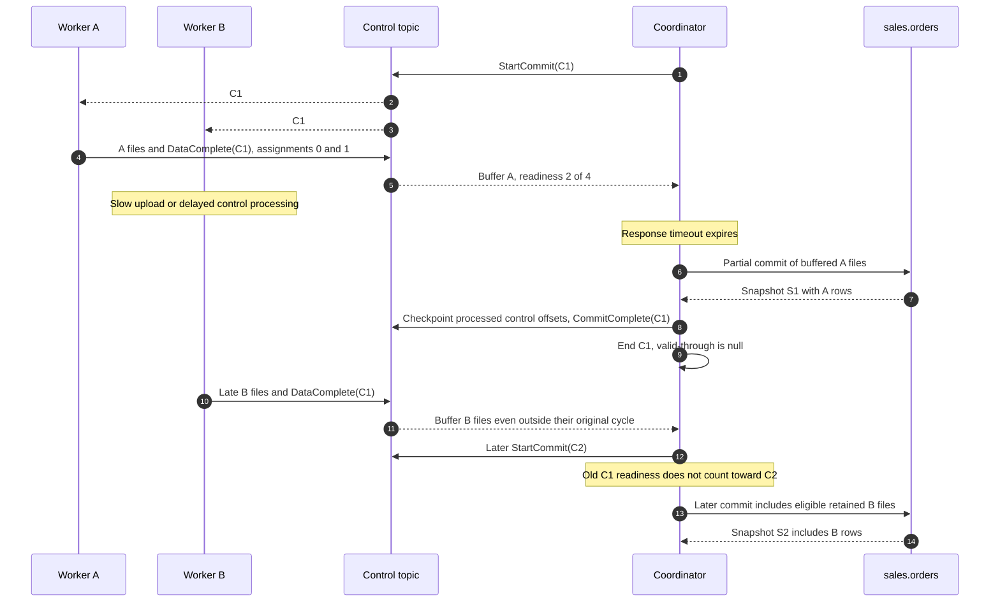

Assume both shown table commits succeed. A partial commit publishes available eligible files, not an invented complete view of all four source partitions. It can also be empty if no file responses arrived. Successful processing clears the file buffer; a failed partial commit normally retains responses for a later cycle. Readiness is reset when the current cycle ends.

`validThroughTs(true)` returns null. For a full cycle, a value is available only if all buffered readiness assignments have timestamps; the code takes their minimum. This uses record timestamps tracked by the writer, not a general proof that all business events up to that event-time have arrived. Old-cycle readiness can be present in the list even though it does not increase the current readiness count.

**Quiet partition versus quiet task:** an already-started worker lists every assigned partition, even one with no new records. But a task that has never received a nonempty batch has not started its `channel.Worker`, so it may not respond at all. Expect timeout/partial behavior rather than assuming “no traffic” means a missing-partition error.

### 11.3 Task fails before its Kafka handoff

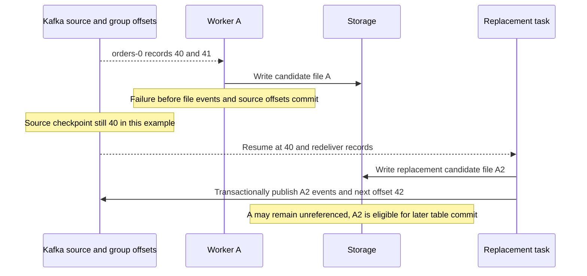

An aborted Kafka transaction's control events are invisible to the coordinator's `read_committed` consumer. File writing itself is not rolled back by aborting Kafka. Depending on the failure and cleanup, a completed or staged file may remain outside committed metadata. File counts in storage are therefore not row-count correctness evidence.

If the transaction's outcome is uncertain, do not assume it aborted: inspect durable offsets/events and let recovery use the actual outcome. This diagram specifically assumes the handoff did not commit.

### 11.4 Task fails after handoff, before table visibility

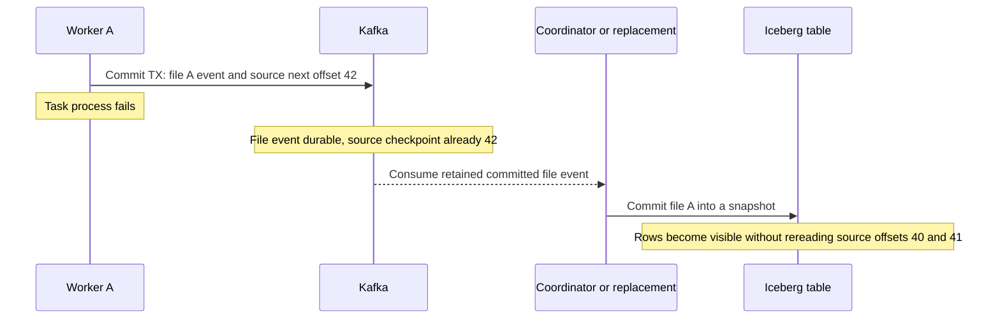

This is the central recovery insight: after handoff, the control log carries pending work. Resetting only source offsets is not the normal recovery mechanism. It can create new files for already handed-off data.

### 11.5 Coordinator fails after a table commit

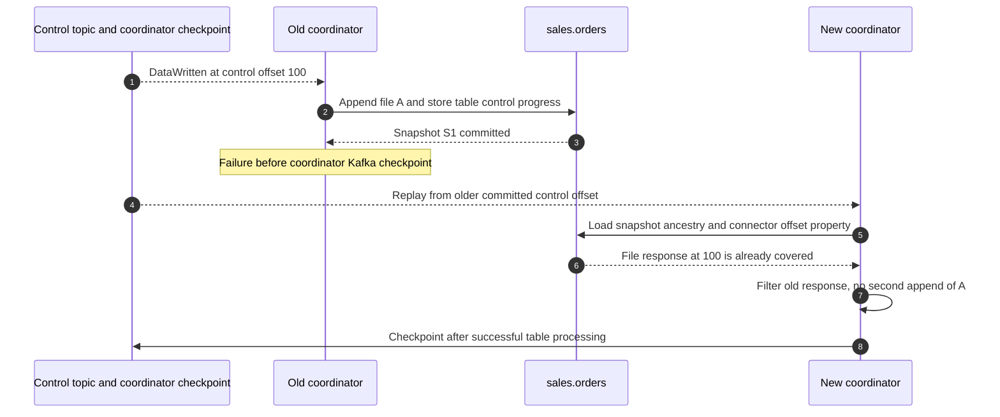

If failure occurred **before** the table commit, its snapshot would not cover offset 100, so the replacement could commit that response. If failure occurred after checkpoint but before `CommitComplete`, the table can already be correct even though the notification is absent.

Normal recovery assumes a usable coordinator checkpoint or sufficient control replay. On the first-ever cycle there may be no coordinator checkpoint yet. A new control consumer using the default `latest` can skip older pending events when no checkpoint exists. The live-instance replay guard does not solve that bootstrap/retention gap.

### 11.6 Source-topic rebalance: ownership changes

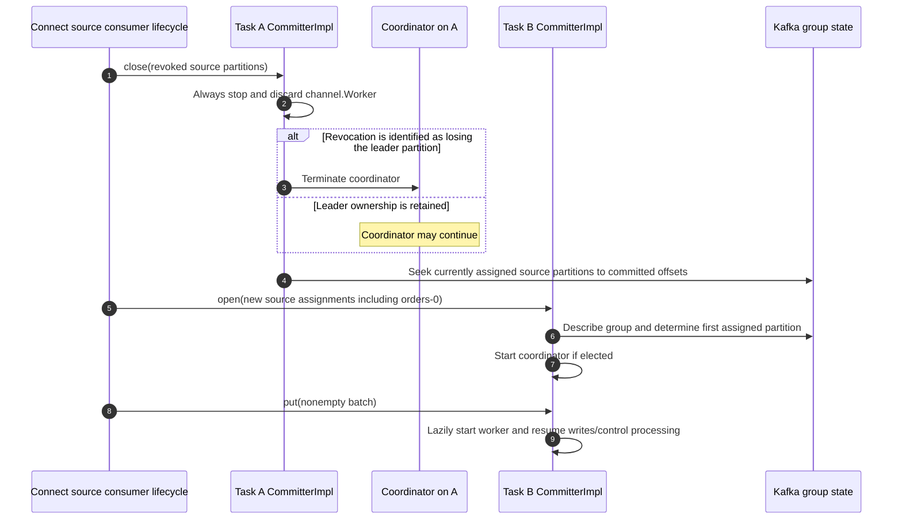

The election/close decisions use the group metadata observed by the code, not a permanently stored leader ID. An empty `close()` means explicit task shutdown and stops its coordinator. Seeking applies only where a committed offset is available; the helper tolerates a partition disappearing before `seek()`.

Distinguish two effects: unhanded-off worker writing state is discarded, while already handed-off work remains in Kafka. A coordinator surviving a nonleader revocation retains its own buffers; a newly created coordinator does not inherit Java objects from the old process.

### 11.7 Control-topic rebalance: same channel rereads events

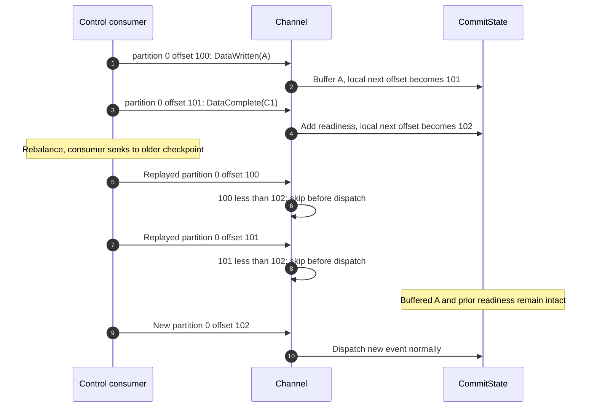

Why preserve state? Reassignment may replay only some partitions or resume at `latest` when a checkpoint is missing. Clearing known file descriptions and assuming every event will return can lose pending work. The current guard suppresses repeated **partition/offset pairs**, not equal payloads, event UUIDs, or business records republished at new offsets.

Upstream's high-water merge alone prevents offset regression but would still dispatch old records. This branch adds the earlier dispatch guard. Both upstream checkpoint protections remain in the rebased source.

### 11.8 Full connector restart

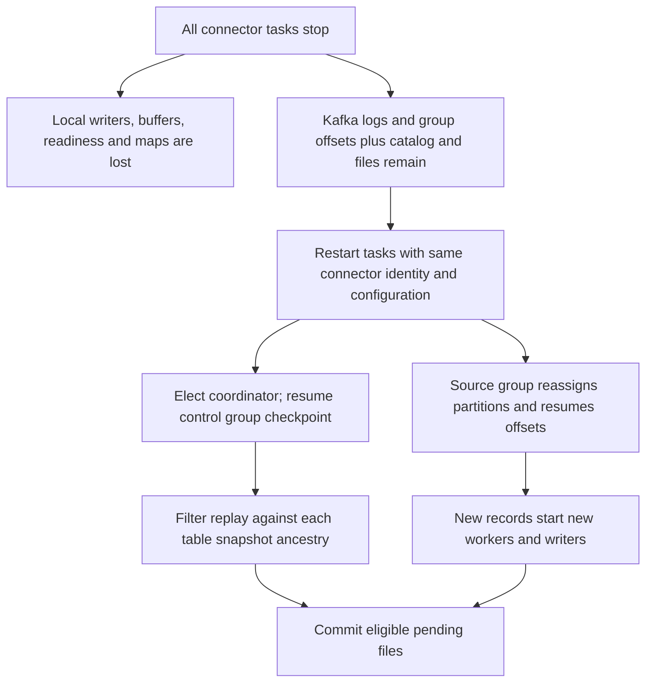

This assumes Kafka, catalog state, relevant snapshots and physical files survive, and control events/checkpoints remain usable. Restarting Connect is different from recreating the entire lab infrastructure. The repository Compose fixture persists MinIO data but does not mount the REST fixture's SQLite database on an equivalent durable volume; recreating that catalog container can lose table registration even while objects remain.

### 11.9 Multi-table partial success

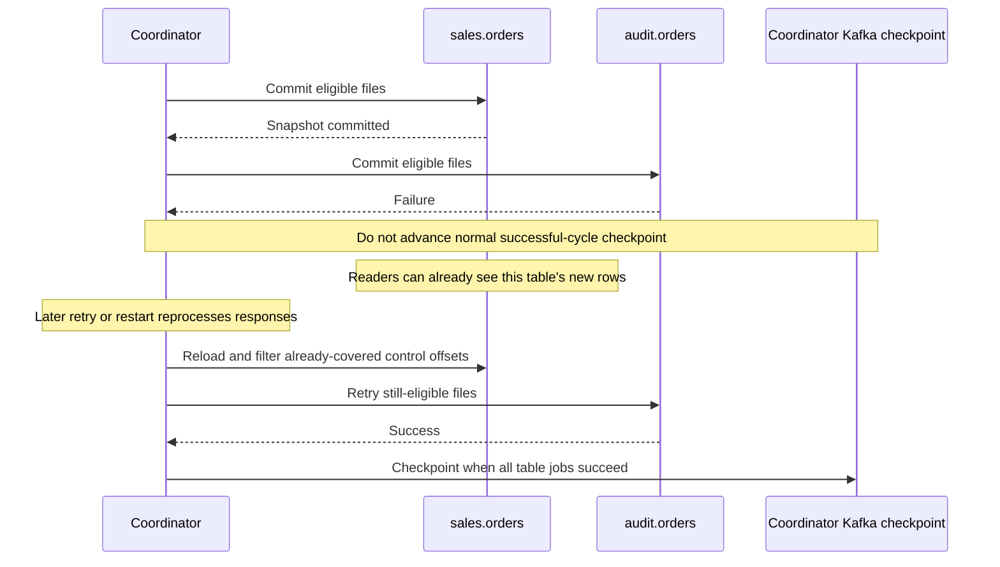

The actual table jobs can run concurrently; the sequence is simplified to expose visibility. There is no rollback of the first table merely because the second failed. The REST specification's multi-table transaction endpoint does not mean this connector uses it.

### 11.10 Other failure and edge cases

| Case | Behavior to trace and expected evidence |
|---|---|
| Kafka transaction failure/fencing | `Channel.send()` attempts abort and rethrows. `read_committed` excludes aborted events. Consumer generation metadata participates in transactional source-offset handoff. Do not interpret `CommitComplete` as the worker's transaction acknowledgment. |
| Storage upload failure | Failure can occur before file completion/handoff; source progress for that handoff should not be assumed committed. Inspect task failure and transaction outcome, not just object listings. |
| REST conflict | Iceberg has its own operation retries. If a full-cycle `CommitFailedException` escapes, coordinator cycle-level retry is bounded by `iceberg.control.commit.max-consecutive-failures`; default 1 means the first such failure terminates. |
| Unknown REST commit outcome | Server may have committed. Limited reconciliation may resolve it; otherwise a full-cycle unknown-state exception propagates immediately. Inspect table history and preserved events before attempting manual repair. |
| Other full-cycle runtime failure | `ValidationException`, authorization errors and other non-`CommitFailedException` runtime errors propagate; the coordinator thread terminates and the task detects it. |
| Partial-cycle failure | Runtime exceptions increment `partialCommitFailures` and return for later retry; the cycle ends. File responses normally remain unless execution already reached the success-path clearing step. |
| Missing commit target | `Coordinator.commitToTable()` logs and skips a missing table. A skipped target can still allow the cycle checkpoint to advance. Missing table does not always imply the connector fails. |
| Table dropped/recreated with the same name | A UUID mismatch causes old responses to be skipped; names alone do not establish table identity. |
| Unmatched route or null routing field | Record can be skipped while its source offset is still tracked. Verify routing when offsets advance but rows are absent. |
| Missing dynamic table | With auto-create disabled, the factory can choose `NoOpWriter`; this is an intentional skip path. |
| Null value/tombstone | Normal `IcebergWriter` ignores null values. No automatic Iceberg delete is implied. |
| Duplicate business key | Distinct source records can create distinct rows. Identifier fields are not a uniqueness constraint. |
| Schema mismatch/evolution | Conversion may fail, or enabled schema evolution updates metadata and restarts a writer. Auto-create/evolution are worker-side catalog mutations, so centralized data commits do not mean workers never mutate metadata. |
| Empty or duplicate file descriptors | Coordinator filters zero-record files and duplicate locations within the candidate batch. This is not a global scan for duplicate row values. |
| No usable control checkpoint / expired log | Default `latest` can miss earlier pending events. No code path reconstructs missing `DataWritten` payloads from table data directories. |
| Control-topic compaction | Events are keyed by producer ID, not a unique key per file response. Latest-value-per-key retention would not preserve the event history the recovery protocol needs. |
| Named table branch | Coordinator loads and validates that branch's ancestry. Inspect that ref rather than assuming main changed. REST unknown-state reconciliation is narrower for this case. |
| Notification publication failure | A snapshot can commit before `CommitToTable` fails, or a control checkpoint can commit before `CommitComplete` fails. Notification absence is not proof of absent table progress. |

## 12. Resetting offsets and deliberate reprocessing

There is no Iceberg connector REST endpoint in these packages that atomically resets source consumption, control events, table snapshots and in-memory state. Kafka Connect management APIs and Kafka consumer-group administration operate on different layers from Iceberg table metadata.

### Choose the intended operation

| Intention | What to reason about |
|---|---|
| Recover a failed task | Preserve identity, source/control checkpoints, pending events and table history; restart and use normal protocol recovery |
| Rebuild an experimental table from source | Use a fresh destination table, connector/source group and control topic; start source consumption from the intended retained position |
| Rewind source offsets into the existing append table | Previously ingested records are rewritten into new files with new control offsets; duplicate rows are possible |
| Rewind coordinator control offsets | Replays durable file responses; existing table snapshot offsets can filter previously committed responses |
| Roll back an Iceberg snapshot | Changes table visibility/history, not Kafka source offsets or coordinator checkpoints; normal ingestion does not automatically refill the rolled-back rows |

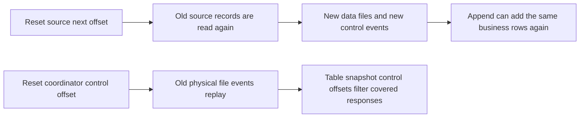

For a disposable learning rebuild, choose a new connector such as `orders-rebuild`, a new control topic `control-orders-rebuild`, and a new table `sales.orders_rebuild`. Set the new source consumer's initial reset policy to `earliest`. A new group has no committed source offsets; this policy can then select the earliest **retained** source position. Merely changing `auto.offset.reset` on a group with valid offsets does not rewind it.

For an existing-group reset exercise, stop its consumers first and begin with a dry run:

```bash
kafka-consumer-groups --bootstrap-server localhost:29092 \
  --group connect-orders-sink --topic orders \
  --reset-offsets --to-earliest --dry-run
```

This command only previews source offset changes. Applying them would require a deliberate replay/table policy; it would not reset the coordinator group or snapshot summaries. Kafka CLI names may have a `.sh` suffix in an Apache Kafka distribution. Kafka Connect offset-management endpoint availability depends on the deployed Kafka version and is not implemented by this Iceberg code.

Do not manually republish a copied `DataComplete` as a “retry”: at a new physical control offset it is a new dispatch, and readiness uses assignment counts. The replay guard is not a protocol validator for arbitrary hand-crafted events.

## 13. Local end-to-end exercise

This is a source-backed lab recipe, **not a claim that Docker integration scenarios were executed while preparing the document**. Use a disposable local environment. The sequence diagrams above are conceptual traces; the checks in section 14 state what was actually run.

### 13.1 Prerequisites and service layout

- Docker with Compose, a working Java/Gradle environment, `curl`, and `jq`.
- `kcat` available on the host for explicit-partition production; it is an optional lab tool, not a project dependency.
- Free host ports 8083, 8181, 9000, 9001 and 29092.
- The connector distribution built from this checkout.

The [Compose fixture][compose] and [integration harness][integration-base] are the sources for this setup. Run repository commands from the repository root:

```bash
./gradlew :iceberg-kafka-connect:iceberg-kafka-connect-runtime:installDist
docker compose -f kafka-connect/kafka-connect-runtime/docker/docker-compose.yml up -d
```

The fixture mounts `kafka-connect/kafka-connect-runtime/build/install` into the Connect plugin path. Wait until these checks succeed:

```bash
curl --fail http://localhost:8083/connector-plugins
curl --fail http://localhost:8181/v1/config
```

Confirm `org.apache.iceberg.connect.IcebergSinkConnector` appears in the plugin list. Creating the application/control topics can use the Kafka tools in the fixture container:

```bash
docker compose -f kafka-connect/kafka-connect-runtime/docker/docker-compose.yml exec kafka \
  kafka-topics --bootstrap-server kafka:9092 --create \
  --topic orders --partitions 4 --replication-factor 1

docker compose -f kafka-connect/kafka-connect-runtime/docker/docker-compose.yml exec kafka \
  kafka-topics --bootstrap-server kafka:9092 --create \
  --topic control-orders --partitions 1 --replication-factor 1
```

One control partition keeps the first experiment easy to inspect. Source partitions remain four. The fixture is single-broker and configures transaction-state replication accordingly; that is a lab topology, not a production availability design.

### 13.2 Connector configuration

Save the following as a local `orders-sink.json` when running the exercise. The sample uses the fixture's published local-development credentials. It auto-creates an unpartitioned format-v2 table and leaves schema evolution disabled for a stable first experiment.

```json
{
  "name": "orders-sink",
  "config": {
    "connector.class": "org.apache.iceberg.connect.IcebergSinkConnector",
    "tasks.max": "2",
    "topics": "orders",
    "key.converter": "org.apache.kafka.connect.storage.StringConverter",
    "value.converter": "org.apache.kafka.connect.json.JsonConverter",
    "value.converter.schemas.enable": "false",
    "consumer.override.auto.offset.reset": "earliest",
    "iceberg.tables": "sales.orders",
    "iceberg.tables.auto-create-enabled": "true",
    "iceberg.tables.auto-create-props.format-version": "2",
    "iceberg.tables.auto-create-props.write.format.default": "parquet",
    "iceberg.control.topic": "control-orders",
    "iceberg.control.commit.interval-ms": "10000",
    "iceberg.control.commit.timeout-ms": "5000",
    "iceberg.catalog.type": "rest",
    "iceberg.catalog.uri": "http://iceberg:8181",
    "iceberg.catalog.warehouse": "s3://bucket/warehouse/",
    "iceberg.catalog.io-impl": "org.apache.iceberg.aws.s3.S3FileIO",
    "iceberg.catalog.s3.endpoint": "http://minio:9000",
    "iceberg.catalog.s3.path-style-access": "true",
    "iceberg.catalog.client.region": "us-east-1",
    "iceberg.catalog.s3.access-key-id": "minioadmin",
    "iceberg.catalog.s3.secret-access-key": "minioadmin",
    "iceberg.kafka.bootstrap.servers": "kafka:9092"
  }
}
```

The Connect worker must permit the `consumer.override.*` setting under its client override policy. Use this with a fresh connector group so `earliest` has an effect. The config's `iceberg` and `minio` hostnames are resolved **inside containers**. Host clients use `localhost:8181`, `localhost:9000`, and `localhost:29092` instead.

Deploy and inspect:

```bash
curl --fail -X POST http://localhost:8083/connectors \
  -H 'Content-Type: application/json' --data-binary @orders-sink.json

curl --fail http://localhost:8083/connectors/orders-sink/status | jq .
```

Expected: connector and tasks reach `RUNNING`. This confirms lifecycle health, not that any snapshot exists yet. A `409` deploying an existing name means inspect/update that connector or use a fresh name; it is not a row-ingestion result.

### 13.3 Produce one record into each partition

Run each command, enter its matching line below, then press Ctrl-D. `-K:` separates the string key from the JSON value; `-p` explicitly selects the partition. The command ends after stdin closes.

```bash
kcat -b localhost:29092 -t orders -P -p 0 -K:
```

```text
O-100:{"order_id":"O-100","customer_id":"C-7","amount":42.50,"region":"eu"}
```

```bash
kcat -b localhost:29092 -t orders -P -p 1 -K:
```

```text
O-101:{"order_id":"O-101","customer_id":"C-8","amount":17.25,"region":"us"}
```

```bash
kcat -b localhost:29092 -t orders -P -p 2 -K:
```

```text
O-102:{"order_id":"O-102","customer_id":"C-9","amount":81.10,"region":"eu"}
```

```bash
kcat -b localhost:29092 -t orders -P -p 3 -K:
```

```text
O-103:{"order_id":"O-103","customer_id":"C-10","amount":9.75,"region":"apac"}
```

JSON schema inference makes this a simple map-based exercise; `amount` is illustrative numeric data, not a prescribed financial decimal schema. For a typed decimal/timestamp lesson, pre-create the table and use a compatible converter schema.

Produce a second batch with new IDs, such as `O-104` through `O-107`, using the same commands and value shape. With a fresh topic and no other producers, two records per partition give source next offsets of 2. The two batches may land in one or several snapshots depending on timing; do not require one file or one snapshot per command.

### 13.4 Inspect the three interfaces

**Connect status and logs:**

```bash
curl --fail http://localhost:8083/connectors/orders-sink/status | jq .
docker compose -f kafka-connect/kafka-connect-runtime/docker/docker-compose.yml logs connect
```

Look for leader election, `Coordinator ... initiated commit`, `Sending event of type`, and `completed commit to table` messages. The commit UUID correlates the cycle across messages.

**Source and coordinator offsets:**

```bash
docker compose -f kafka-connect/kafka-connect-runtime/docker/docker-compose.yml exec kafka \
  kafka-consumer-groups --bootstrap-server kafka:9092 \
  --group connect-orders-sink --describe

docker compose -f kafka-connect/kafka-connect-runtime/docker/docker-compose.yml exec kafka \
  kafka-consumer-groups --bootstrap-server kafka:9092 \
  --group connect-orders-sink-coord --describe
```

The first lists source partition progress; the second lists control-topic progress. Control offsets include more than `DataWritten`: starts, readiness and notifications also consume log positions. Kafka transaction markers can introduce offset gaps, so do not equate next offset with a simple count of visible application events.

**Iceberg REST metadata:** the local fixture uses no URL prefix in this example.

```bash
curl --fail http://localhost:8181/v1/namespaces/sales/tables/orders \
  | jq '{location: .["metadata-location"], snapshot: .metadata["current-snapshot-id"], refs: .metadata.refs}'

curl --fail http://localhost:8181/v1/namespaces/sales/tables/orders \
  | jq '.metadata.snapshots[] | {id: .["snapshot-id"], summary: .summary, manifests: .["manifest-list"]}'
```

The table is created only after a record starts its writer. A load before then may return not-found. Inspect snapshot summaries for `kafka.connect.offsets.control-orders.connect-orders-sink` and the commit ID.

**Storage:** open the MinIO console at `http://localhost:9001` and follow the metadata/data locations returned by the catalog. This shows physical objects; the snapshot determines membership.

**Rows and metadata tables:** with an Iceberg-enabled Spark session whose catalog `prod` points at this REST catalog and can reach MinIO, use:

```sql
SELECT order_id, customer_id, amount, region FROM prod.sales.orders ORDER BY order_id;
SELECT committed_at, snapshot_id, operation, summary FROM prod.sales.orders.snapshots;
SELECT * FROM prod.sales.orders.metadata_log_entries;
SELECT * FROM prod.sales.orders.manifests;
SELECT file_path, record_count FROM prod.sales.orders.files;
```

Spark is not included in this Compose fixture. Configure its REST URI and FileIO/S3 access for the network where Spark runs; host-side settings differ from Connect's container settings. See [Spark metadata-table queries][spark-queries]. The REST catalog does not itself execute these SQL statements.

### 13.5 Guided happy/unhappy experiments

| Experiment | Action in the disposable lab | Observe |
|---|---|---|
| Happy path | Produce both batches, wait through commit cycles | Rows eventually visible; source offsets can lead snapshot publication |
| Quiet task | Start fresh, initially produce only to one partition | Worker startup is lazy; partial cycles may occur until other tasks receive records |
| Full Connect restart | Restart only the `connect` service, then produce new IDs | New task instances and leader; existing catalog/files persist; source/control checkpoint recovery |
| More/fewer tasks | Use Connect's config-update API with the complete config and a changed `tasks.max` | Source assignment changes and leader ownership; more tasks than partitions cannot create more source parallelism |
| REST outage | Stop `iceberg` temporarily while keeping Kafka/storage running, then restore it | Catalog failures and task status; retry/termination depends on where the failure occurs |
| Duplicate business key | Produce a new source record with `order_id=O-100` | Append semantics do not enforce one row per key |
| Safe replay comparison | Deploy a new connector/table/control topic from retained source history | Rebuilt table can be compared to the original without mixing deliberate replay into it |

For a simple restart demonstration:

```bash
docker compose -f kafka-connect/kafka-connect-runtime/docker/docker-compose.yml restart connect
```

A one-worker Compose setup cannot isolate “kill Task B's process but keep Task A's process alive”: both tasks share the JVM. Use two Connect worker processes for that experiment. Exact crash-window and same-instance control-replay scenarios are covered more deterministically by the regression tests than by timing a manual container stop.

Do not use restarting the catalog container as a substitute for a Connect restart. Service restart, container recreation, consumer rebalance and offset reset are distinct experiments with different retained state.

## 14. Debugging and verification

### Follow evidence in this order

1. **Configuration and task status:** is the connector class loaded, are converters correct, and are tasks running?
2. **Source assignments:** which task owns each source partition, and who owns the lexically first one?
3. **Worker activity:** did the task receive a nonempty batch and create its worker/table writer?
4. **File handoff:** did its Kafka transaction commit? Check source progress and decoded control events when available.
5. **Coordinator readiness:** which commit UUID is active; which assignment counts arrived; did a timeout occur?
6. **Table commit:** inspect table identity, selected branch, snapshot ID and connector summary offsets.
7. **Coordinator checkpoint:** does control-group progress reflect successful processing?
8. **Reader state:** is the query using refreshed metadata and the intended snapshot/ref?

Control payloads are Avro encoded by `AvroUtil`; a plain text console consumer does not provide a meaningful decoded event trace. Source-topic JSON is a different encoding. Tests use the same Avro utility to construct and decode control events.

### Symptom → likely inspection point

| Symptom | Inspect first |
|---|---|
| Source lag low, table rows absent | Pending control handoff, coordinator status, commit interval, routing skips, selected ref |
| Objects exist, table scan empty | Catalog snapshot membership, pending/abandoned files, reader refresh |
| Repeated timeout logs | Lazy/slow workers, assignments versus captured partition count, control polling |
| Task fails after a coordinator exception | `CoordinatorThread` and `NotRunningException`; underlying commit failure class |
| Rows duplicate after manual rewind | New source processing versus replay of the same physical control response |
| Old files attach to wrong recreated table | UUID filtering and table identity evidence; do not reason from name alone |
| Snapshot looks correct but completion event is missing | Failure between snapshot publication/checkpoint and notification |

### Existing regression evidence

| Test class | Important behaviors |
|---|---|
| [TestChannel] | High-water tracking, non-regressing committed offsets, per-partition progress, physical replay suppression and group filtering |
| [TestCoordinator] | File/snapshot assertions for no replay, partial replay and repeated replay; offset merging/validation; commit failure policy; locally non-increasing checkpoint suppression |
| [TestCommitState] | Readiness count, old commit IDs, valid-through calculation, separate cycle state |
| [TestWorker] | Worker response event sequence and source assignment progress |
| [TestCommitterImpl] | First-partition election and coordinator failure propagation |
| [TestCoordinatorThread] | Coordinator thread lifecycle |
| [TestSinkWriter] | Routing and original topic/partition offset tracking across SMTs |
| [Runtime integration tests][runtime-tests] | Docker-backed catalog/storage/Connect integration, multiple tables, schema changes, branches and dynamic routing |

Run the channel suite and connector formatting check from the repository root:

```bash
./gradlew :iceberg-kafka-connect:iceberg-kafka-connect:test \
  --tests 'org.apache.iceberg.connect.channel.*' \
  :iceberg-kafka-connect:iceberg-kafka-connect:spotlessJavaCheck
```

**Executed after the rebase:** 36 tests across six channel test classes passed, with zero failures, errors or skips; `spotlessJavaCheck` passed. These tests include mock Kafka clients and actual Iceberg snapshot assertions where applicable. They are not a broker-level proof of every failure diagram.

**Document checks:** all 16 Mermaid diagrams rendered successfully to SVG with Mermaid CLI 11.17.0. All 55 relative source links, table-of-contents anchors, requested top-level class links, fenced JSON examples and shell syntax were checked. A separate screenshot-review attempt timed out in Chromium, so no screenshot-based readability review is claimed.

The optional Docker integration command is:

```bash
./gradlew :iceberg-kafka-connect:iceberg-kafka-connect-runtime:integrationTest
```

It starts integration infrastructure and creates/drops test resources. It was not run for this documentation task. The repository also provides REST compatibility tooling in [open-api/README.md][rest-readme].

## 15. Student exercises and glossary

### Check understanding

**1. Source next offset is 42, but the table has no new snapshot. Is that necessarily data loss?**

No. The worker can have durably handed off files and offsets before the coordinator publishes them. Inspect retained control events and coordinator progress.

**2. A source record at offset 41 is processed. What offset is committed?**

42, the next source record position. Do not compare it directly with a control-topic record offset.

**3. Why can A's two assigned partitions contribute two readiness units in one message?**

`DataComplete` contains an assignment list; `CommitState` adds its size for the matching commit UUID. Readiness expects source-partition count, not one acknowledgment per task.

**4. Why is blindly clearing coordinator buffers on a control rebalance dangerous?**

The consumer might not replay all previously seen file responses. Preserving buffers and suppressing repeated physical offsets retains pending work in a surviving instance.

**5. If A's table commit succeeds and B's fails, can a reader see A?**

Yes. Table commits are independent. Retry/recovery filters already-covered responses for A and can continue B.

**6. Can a restart deduplicate old events using the old Java high-water map?**

No. That map is lost. Durable Kafka checkpoints and per-table snapshot offsets provide the restart recovery information.

**7. Does `iceberg.control.commit.timeout-ms=5000` interrupt an S3 upload after five seconds?**

No. It is the coordinator's response timeout, checked in its loop. Storage and Kafka operations have their own timing and failure behavior.

**8. How can a duplicate `order_id` appear with exactly-once delivery?**

Two different Kafka records can contain the same business key. Exactly-once protocol bookkeeping is not a uniqueness constraint or upsert engine.

### Vocabulary

| Term | Meaning in this guide |
|---|---|
| Source partition | One ordered Kafka input log assigned to a sink consumer |
| Next offset | Position from which consumption should resume, normally processed record offset + 1 |
| Control topic | Kafka event log used to coordinate file handoff and table commits |
| Transactional handoff | Atomic Kafka publication of worker file events and source offsets |
| Coordinator | Elected task-local component that commits data-file responses into tables |
| Readiness | Current-cycle response count based on reported source assignments |
| Partial commit | Timeout-triggered attempt to commit eligible buffered responses |
| Replay | Rereading earlier physical control records, unless explicitly called source reprocessing |
| High-water mark | Highest next control position consumed per partition in a live channel |
| Catalog | Service/library managing table identity and metadata publication |
| FileIO | Abstraction for reading/writing physical objects or files |
| Manifest | Metadata file describing table data/delete file entries |
| Manifest list | Snapshot-level list of manifests and their metadata |
| Snapshot | A committed table version represented through metadata references |
| Ref/branch | Named pointer to a snapshot lineage |
| Orphan candidate | File not currently referenced by inspected metadata; not automatically safe to delete |

**Recommended code-reading order:** `IcebergSinkTask` → `CommitterImpl` → `Worker` → `SinkWriter`/`IcebergWriter` → `Channel` → `CommitState`/`Coordinator` → `RESTTableOperations` → `SnapshotProducer`. Revisit the failure diagrams after each layer; the state ownership should become progressively clearer.

<!-- Source index: paths are relative to the repository root. -->
[IcebergSinkConnector]: kafka-connect/kafka-connect/src/main/java/org/apache/iceberg/connect/IcebergSinkConnector.java
[IcebergSinkTask]: kafka-connect/kafka-connect/src/main/java/org/apache/iceberg/connect/IcebergSinkTask.java
[IcebergSinkConfig]: kafka-connect/kafka-connect/src/main/java/org/apache/iceberg/connect/IcebergSinkConfig.java
[TableSinkConfig]: kafka-connect/kafka-connect/src/main/java/org/apache/iceberg/connect/TableSinkConfig.java
[CatalogUtils]: kafka-connect/kafka-connect/src/main/java/org/apache/iceberg/connect/CatalogUtils.java
[Committer]: kafka-connect/kafka-connect/src/main/java/org/apache/iceberg/connect/Committer.java
[CommitterFactory]: kafka-connect/kafka-connect/src/main/java/org/apache/iceberg/connect/CommitterFactory.java
[CommitterImpl]: kafka-connect/kafka-connect/src/main/java/org/apache/iceberg/connect/channel/CommitterImpl.java
[Channel]: kafka-connect/kafka-connect/src/main/java/org/apache/iceberg/connect/channel/Channel.java
[Worker]: kafka-connect/kafka-connect/src/main/java/org/apache/iceberg/connect/channel/Worker.java
[Coordinator]: kafka-connect/kafka-connect/src/main/java/org/apache/iceberg/connect/channel/Coordinator.java
[CommitState]: kafka-connect/kafka-connect/src/main/java/org/apache/iceberg/connect/channel/CommitState.java
[CoordinatorThread]: kafka-connect/kafka-connect/src/main/java/org/apache/iceberg/connect/channel/CoordinatorThread.java
[KafkaClientFactory]: kafka-connect/kafka-connect/src/main/java/org/apache/iceberg/connect/channel/KafkaClientFactory.java
[KafkaUtils]: kafka-connect/kafka-connect/src/main/java/org/apache/iceberg/connect/channel/KafkaUtils.java
[Envelope]: kafka-connect/kafka-connect/src/main/java/org/apache/iceberg/connect/channel/Envelope.java
[NotRunningException]: kafka-connect/kafka-connect/src/main/java/org/apache/iceberg/connect/channel/NotRunningException.java
[SinkWriter]: kafka-connect/kafka-connect/src/main/java/org/apache/iceberg/connect/data/SinkWriter.java
[IcebergWriterFactory]: kafka-connect/kafka-connect/src/main/java/org/apache/iceberg/connect/data/IcebergWriterFactory.java
[RecordWriter]: kafka-connect/kafka-connect/src/main/java/org/apache/iceberg/connect/data/RecordWriter.java
[IcebergWriter]: kafka-connect/kafka-connect/src/main/java/org/apache/iceberg/connect/data/IcebergWriter.java
[NoOpWriter]: kafka-connect/kafka-connect/src/main/java/org/apache/iceberg/connect/data/NoOpWriter.java
[RecordConverter]: kafka-connect/kafka-connect/src/main/java/org/apache/iceberg/connect/data/RecordConverter.java
[RecordUtils]: kafka-connect/kafka-connect/src/main/java/org/apache/iceberg/connect/data/RecordUtils.java
[SchemaUtils]: kafka-connect/kafka-connect/src/main/java/org/apache/iceberg/connect/data/SchemaUtils.java
[SchemaUpdate]: kafka-connect/kafka-connect/src/main/java/org/apache/iceberg/connect/data/SchemaUpdate.java
[PartitionedAppendWriter]: kafka-connect/kafka-connect/src/main/java/org/apache/iceberg/connect/data/PartitionedAppendWriter.java
[Offset]: kafka-connect/kafka-connect/src/main/java/org/apache/iceberg/connect/data/Offset.java
[IcebergWriterResult]: kafka-connect/kafka-connect/src/main/java/org/apache/iceberg/connect/data/IcebergWriterResult.java
[SinkWriterResult]: kafka-connect/kafka-connect/src/main/java/org/apache/iceberg/connect/data/SinkWriterResult.java
[events]: kafka-connect/kafka-connect-events/src/main/java/org/apache/iceberg/connect/events/
[AvroUtil]: kafka-connect/kafka-connect-events/src/main/java/org/apache/iceberg/connect/events/AvroUtil.java
[CatalogUtil]: core/src/main/java/org/apache/iceberg/CatalogUtil.java
[RESTCatalog]: core/src/main/java/org/apache/iceberg/rest/RESTCatalog.java
[RESTSessionCatalog]: core/src/main/java/org/apache/iceberg/rest/RESTSessionCatalog.java
[RESTTableOperations]: core/src/main/java/org/apache/iceberg/rest/RESTTableOperations.java
[ResourcePaths]: core/src/main/java/org/apache/iceberg/rest/ResourcePaths.java
[CatalogHandlers]: core/src/main/java/org/apache/iceberg/rest/CatalogHandlers.java
[JdbcTableOperations]: core/src/main/java/org/apache/iceberg/jdbc/JdbcTableOperations.java
[SnapshotProducer]: core/src/main/java/org/apache/iceberg/SnapshotProducer.java
[LocationProviders]: core/src/main/java/org/apache/iceberg/LocationProviders.java
[format-spec]: format/spec.md
[rest-spec]: open-api/rest-catalog-open-api.yaml
[rest-readme]: open-api/README.md
[compose]: kafka-connect/kafka-connect-runtime/docker/docker-compose.yml
[integration-base]: kafka-connect/kafka-connect-runtime/src/integration/java/org/apache/iceberg/connect/IntegrationTestBase.java
[runtime-tests]: kafka-connect/kafka-connect-runtime/src/integration/java/org/apache/iceberg/connect/
[spark-queries]: docs/docs/spark-queries.md
[TestChannel]: kafka-connect/kafka-connect/src/test/java/org/apache/iceberg/connect/channel/TestChannel.java
[TestCoordinator]: kafka-connect/kafka-connect/src/test/java/org/apache/iceberg/connect/channel/TestCoordinator.java
[TestCommitState]: kafka-connect/kafka-connect/src/test/java/org/apache/iceberg/connect/channel/TestCommitState.java
[TestWorker]: kafka-connect/kafka-connect/src/test/java/org/apache/iceberg/connect/channel/TestWorker.java
[TestCommitterImpl]: kafka-connect/kafka-connect/src/test/java/org/apache/iceberg/connect/channel/TestCommitterImpl.java
[TestCoordinatorThread]: kafka-connect/kafka-connect/src/test/java/org/apache/iceberg/connect/channel/TestCoordinatorThread.java
[TestSinkWriter]: kafka-connect/kafka-connect/src/test/java/org/apache/iceberg/connect/data/TestSinkWriter.java
