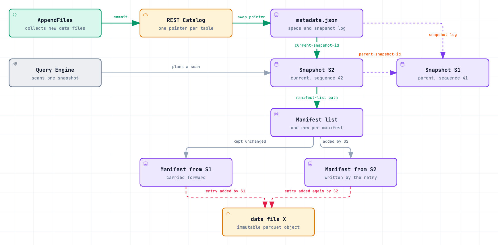
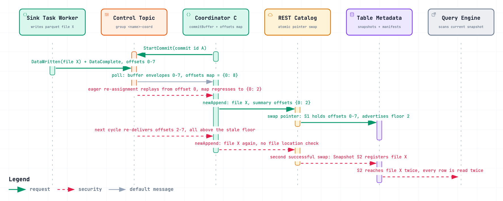
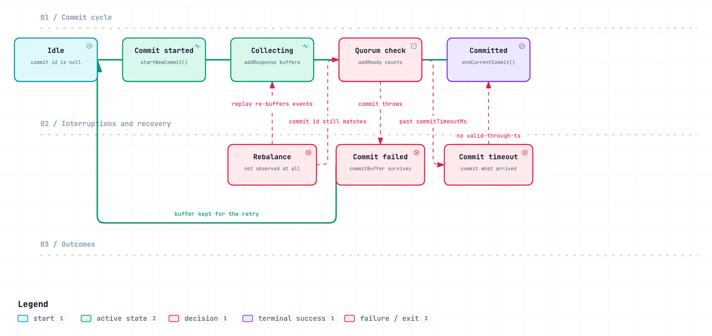
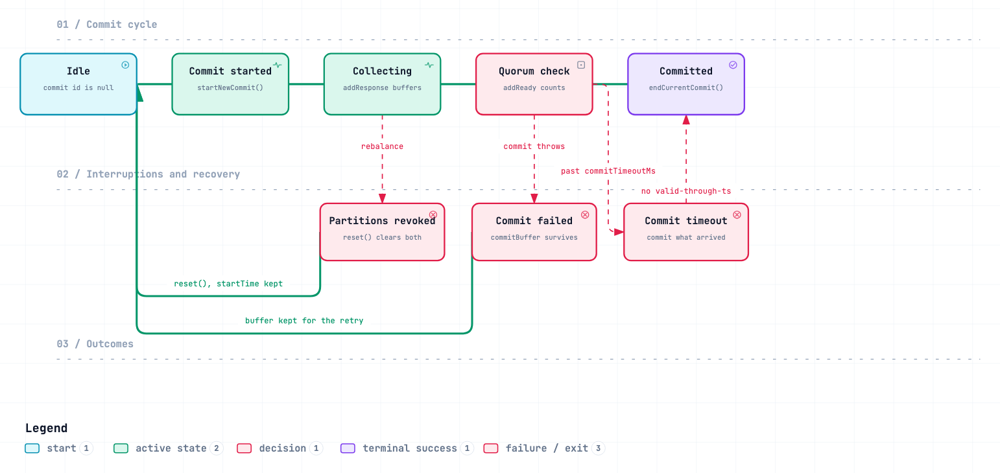
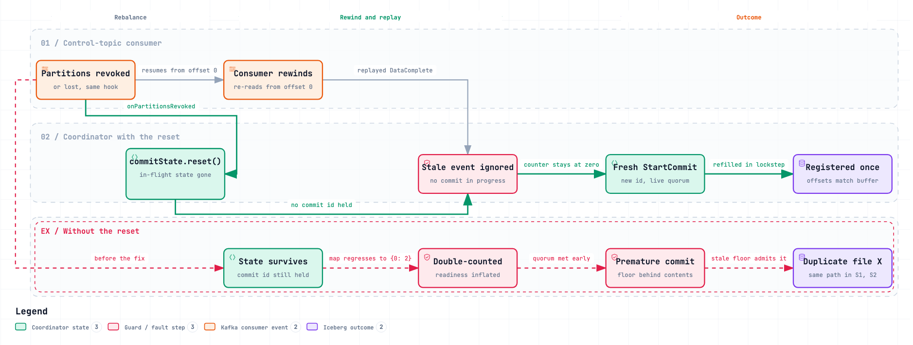

# One Parquet File, Two Snapshots: Anatomy of a Duplicate-Row Bug in Iceberg's Kafka Connect Sink

*A walkthrough of [apache/iceberg#16282](https://github.com/apache/iceberg/issues/16282), from "what even is a snapshot" to a three-line fix.*

By Nahid ([@nahidupa](https://github.com/nahidupa))

---

## TL;DR

A production Iceberg table fed by the Kafka Connect sink ended up with **the same Parquet file registered in two different snapshots**. Every row in that file was returned twice by every query. 4,873 duplicate rows in one incident.

Nothing was corrupted. Every file was written correctly. The catalog did its job. The table metadata was, by the letter of the format spec, completely valid.

The cause was a Kafka consumer rebalance that silently rewound a consumer, combined with a coordinator that had no idea the rebalance had happened. The fix is a three-line method.

This post explains it from the ground up. **If you have never used Iceberg, start at Part 1 — you'll need it.**

---

## Part 1: What an Iceberg table actually is

### The problem Iceberg solves

Put a million Parquet files in a cloud bucket. Now answer these questions:

- Which files are part of the table *right now*?
- If a writer is halfway through adding 200 files and crashes, how does a reader avoid seeing the partial result?
- If two writers add files at the same time, how do you stop one from clobbering the other?
- How do you read the table as it looked yesterday?

Object stores (S3, GCS, Azure Blob) give you almost nothing here. `LIST` is slow, eventually consistent on some systems, and tells you *what files exist*, not *what files belong to the table*. There are no transactions.

Iceberg's answer: **stop listing the bucket. Keep an explicit, immutable, versioned list of files.**

### The four layers

An Iceberg table is a tree of metadata files, and it always looks like this:



Read it left to right, then top to bottom:

1. **The catalog** holds exactly one mutable thing per table: a pointer to the current `metadata.json`. That is the *only* mutable state in the entire system.
2. **`metadata.json`** holds the schema, partition specs, sort orders, the full snapshot log, and `current-snapshot-id`.
3. **A snapshot** is a complete list of every file in the table at one instant. It carries an id, a parent snapshot id, a sequence number, and a free-form summary map.
4. **A manifest list** (`.avro`) has one row per manifest file, with partition range statistics so a scan can skip whole manifests.
5. **A manifest file** has one row per data file, with column-level statistics so a scan can skip whole files.
6. **Data files** are immutable Parquet/ORC/Avro objects.

### The rule that makes everything work

> **Nothing is ever edited. A commit only ever writes new files and swaps one pointer.**

Adding data to an Iceberg table looks like this:

1. Write the new Parquet files. (Readers cannot see them — nothing references them yet.)
2. Write a new manifest file listing them.
3. Write a new manifest list: the manifests this snapshot inherited, **plus** the new one.
4. Write a new `metadata.json` with a new snapshot and a new `current-snapshot-id`.
5. Ask the catalog to **compare-and-swap** the table's pointer: "change it from `...532046.json` to `...532047.json`, but only if it's still `...532046.json`."

Step 5 is the entire transaction. Everything before it is invisible. If two writers race, one CAS wins and the other gets `CommitFailedException`, re-reads the new current metadata, rebuilds its manifests on top, and retries.

If you have ever seen this in Iceberg logs, now you know exactly what it is:

```
Cannot commit: metadata location ...532037... has changed from ...532038...
```

That is a losing CAS. It is normal. It is the concurrency control working.

Because old snapshots are never deleted until you explicitly expire them, "read the table as of yesterday" is just "follow a different `snapshot-id`". Time travel is free — it falls out of the design.

### The gap that matters for this bug

Look at the bottom of the diagram again. Two manifests. One data file. Two red arrows.

**Nothing in the Iceberg format, and nothing in `AppendFiles`, requires a data file location to appear only once.**

A snapshot's manifest list carries the manifests it inherited *plus* the manifests this commit added. If manifest A (inherited from snapshot S1) lists `file-X.parquet`, and manifest B (added by snapshot S2) *also* lists `file-X.parquet`, then S2 reaches that object through two paths. A scan reads every manifest entry it finds. It reads `file-X.parquet` twice. It returns its rows twice.

There is no validation that catches this. There is no error. The metadata is well-formed.

**This is important to state precisely, because it is easy to get backwards:**

| Question | Answer |
|---|---|
| Why did the duplicate *happen*? | A Kafka Connect bug submitted the same file twice. |
| Why did nothing *reject* it? | Iceberg has no uniqueness constraint on file locations. |

The second fact is not the cause. It is the reason the first fact produced twenty minutes of silent data corruption instead of a loud failure. Fix the writer and the duplicate is never created.

---

## Part 2: Who writes these commits — the Kafka Connect sink

The Iceberg Kafka Connect sink (IKC) streams records from Kafka topics into Iceberg tables. It has a coordination problem: many parallel tasks are writing files, but an Iceberg commit must be a single atomic act.

Its solution:

- **Sink task workers** consume the source topic, write Parquet files, and announce them.
- **One task is elected coordinator.** It alone commits to Iceberg.
- A dedicated **control topic** carries the conversation between them.

A commit cycle:

1. The coordinator decides the commit interval has elapsed and sends **`StartCommit(commitId)`** to the control topic.
2. Every worker flushes its open files, then sends **`DataWritten`** (here are the files) and **`DataComplete`** (here are the source-topic offsets I have covered).
3. The coordinator buffers those events. When it has heard from every source partition, it commits all the buffered files to Iceberg in one `AppendFiles` (or `RowDelta` if there are deletes).

### The offset bookkeeping

Now the part that matters. The coordinator's **own** consumer on the **control topic** tracks how far it has read, in a plain map:

```java
// Channel.java:128 — inside consumeAvailable()
controlTopicOffsets.put(record.partition(), record.offset() + 1);
```

When it commits, it writes that map into the **snapshot summary**:

```java
// Coordinator.java:104-106
this.snapshotOffsetsProp =
    String.format("kafka.connect.offsets.%s.%s", config.controlTopic(), config.connectGroupId());
```

So every snapshot the sink creates carries a little note: *"this snapshot accounts for everything up to control-topic offset N."*

On the next commit, the coordinator reads that note back out of the snapshot ancestry and uses it as a **floor** — a watermark below which events are considered already committed and are dropped:

```java
// Coordinator.java:289-297
List<DataWritten> payloads =
    envelopeList.stream()
        .filter(envelope -> {
          Long minOffset = committedOffsets.get(envelope.partition());
          return minOffset == null || envelope.offset() >= minOffset;
        })
        ...
```

**This floor is the sink's entire defence against committing the same event twice.** Hold that thought.

---

## Part 3: The bug

### The symptom

On 2026-05-07, on an **append-only** table with no equality deletes:

- 4,873 duplicate groups
- 9,746 rows where there should have been 4,873
- The same `file_path`, with the same `record_count`, in two snapshots:

```
Snapshot 8264179290764999750  @ 2026-05-07T13:14:36 UTC
Snapshot  314603727896153559  @ 2026-05-07T13:36:44 UTC
```

Between them, twenty consecutive minutes of `Commit timeout reached` — one per minute — while a `Connection timed out` had triggered a coordinator switchover.

Confirmed directly from the metadata:

```sql
WITH base AS (
    SELECT *, COUNT(1) OVER (PARTITION BY file_path) AS _file_count
    FROM <table>.data_files
    TIMESTAMP AS OF '<snapshot_timestamp>'
)
SELECT file_path, record_count, _file_count
FROM base
WHERE _file_count >= 2
```

Reported against IKC 1.10.1 on GCS storage. (The issue text names a REST catalog in one place and a JDBC catalog in another — it does not matter, because nothing in the mechanism depends on which catalog you use.)

### The first theory — and why it was wrong

This part is worth reading, because it is a good example of a plausible bug report being falsified by someone who knew the code.

The original hypothesis was:

1. Coordinator C1 commits file X → snapshot S1 succeeds.
2. C1 crashes before advancing its control-topic consumer offset.
3. Coordinator C2 starts, re-reads the stale `DataWritten` for file X, and commits it again → S2.

Clean, intuitive, and **wrong**. A contributor pointed out immediately that the coordinator does not trust its consumer offset — it reads the floor out of the *table*:

```java
// Coordinator.java:407-417
private Map<Integer, Long> lastCommittedOffsetsForTable(Table table, String branch) {
  Snapshot snapshot = latestSnapshot(table, branch);
  if (snapshot == null) return Map.of();
  Iterable<Snapshot> branchAncestry = SnapshotUtil.ancestorsOf(snapshot.snapshotId(), table::snapshot);
  return lastCommittedOffsets(branchAncestry);
}
```

Any replayed event below that floor is filtered out. A plain crash-and-replay cannot produce a duplicate.

### The real mechanism: the floor goes backwards

The reporter came back with a sharper theory: the filter is fine — **the floor itself is wrong.**

Look at that `put()` again:

```java
controlTopicOffsets.put(record.partition(), record.offset() + 1);
```

It is a plain `put`, not a max-merge. If the consumer ever re-reads a record it has already seen, this **overwrites a higher value with a lower one.**

"But there is no `seek()` anywhere in the code." Correct — and that is exactly why this was hard to find.

The coordinator's control-topic consumer is **group-managed** (`subscribe()`, not `assign()`), so it participates in rebalances. IKC never sets `partition.assignment.strategy`, so the client default applies: `[RangeAssignor, CooperativeStickyAssignor]`, and the protocol is taken from the first entry — **eager**.

An eager rebalance revokes *every* partition and discards its fetch position, **even for a member that is handed the same partition straight back**. `updateFetchPositions()` then refetches the last *committed* offset. The consumer rewinds. There is no `seek()` because the rewind happens inside the client.

What triggers a rebalance? The coordinator runs on whichever task owns the lowest source partition, so every source-side rebalance that moves that partition starts or stops a coordinator — which changes control-topic group membership. Source-side rebalances flap. A `Connection timed out` is more than enough.

Now the sequence:



Step by step:

| # | What happens | Consequence |
|---|---|---|
| 1 | Coordinator opens commit A, worker writes file X, sends `DataWritten` + `DataComplete` at control offsets 0–7 | buffer holds 0–7, offsets map = `{0: 8}` |
| 2 | Eager re-assignment drops the fetch position; the consumer replays from offset 0 | `put()` **regresses** the map to `{0: 2}` — but the buffer still holds envelopes through offset 7 |
| 3 | The replayed `DataComplete` is counted a *second* time, so the readiness quorum is met early | commit A fires with only part of the data |
| 4 | The commit writes the **regressed** map into the snapshot summary | **S1 contains offsets 0–7 but advertises a floor of 2** |
| 5 | Next cycle re-delivers offsets 2–7. They are all `>= 2`, so the filter passes them | file X is appended **again** → S2 |
| 6 | S2's manifest list reaches file X through two manifests | every row read twice |

**The snapshot lies about its own contents.** Once the recorded floor is behind the data the snapshot actually holds, the deduplication filter is disarmed for exactly the range of events that were already committed.

### Why the existing guards don't catch it

Three separate mechanisms all look like they should stop this, and all three miss:

**`distinctByKey`** (`Coordinator.java:304`) deduplicates by file location — but only *within a single commit batch*. The two registrations are in different batches.

**The snapshot ancestry validator** (`Coordinator.java:373-393`) compares the floor it expects against the floor actually recorded in the table:

```java
public boolean validate(Iterable<Snapshot> baseSnapshots) {
  lastCommittedOffsets = lastCommittedOffsets(baseSnapshots);
  return expectedOffsets.equals(lastCommittedOffsets);
}
```

Both sides are already the regressed value, so it passes. This guard protects against a *concurrent writer* changing the floor during a retry. It cannot detect a floor that was written behind its own snapshot in the first place.

**`AppendFiles`** has no uniqueness constraint on file location, as established in Part 1.

---

## Part 4: `CommitState` — the class at the centre

Every step of that failure runs through one small class: `CommitState`. To understand the fix you need to understand this class, so here it is as it stood **before** any fix:



Five fields, and one of them is the discriminator for everything else:

```java
private final List<Envelope> commitBuffer = Lists.newArrayList();      // DataWritten envelopes
private final List<DataComplete> readyBuffer = Lists.newArrayList();   // DataComplete payloads
private int receivedPartitionCount = 0;                                // the quorum counter
private long startTime;                                                // the clock
private UUID currentCommitId;                                          // null == no commit in flight
```

`currentCommitId != null` **is** `isCommitInProgress()`. That single field gates the whole class.

### Three design decisions worth naming

**1. Two buffers, deliberately different lifetimes.**

`endCurrentCommit()` runs in a `finally` block, so `readyBuffer`, the counter and the commit id clear on *every* outcome:

```java
// Coordinator.java:210-212
} finally {
  commitState.endCurrentCommit();
}
```

But `clearResponses()` — which clears `commitBuffer` — runs **only after every table committed successfully**:

```java
// Coordinator.java:227-229
// we should only get here if all tables committed successfully...
commitConsumerOffsets();
commitState.clearResponses();
```

That asymmetry is what makes a failed commit retryable: the data files are still buffered for the next attempt. It is a good design decision, and it is *also* the reason stale envelopes can outlive the commit that collected them.

**2. One clock serving two mutually exclusive deadlines.**

`startTime` is read by both `isCommitIntervalReached()` (guarded by `!isCommitInProgress()` — only runs while idle) and `isCommitTimedOut()` (guarded by `isCommitInProgress()` — only runs while busy). Same field, never both at once.

**3. The commit id is the staleness guard.**

`addResponse` is permissive — it buffers unconditionally and merely warns:

```java
// CommitState.java:51-59
void addResponse(Envelope envelope) {
  commitBuffer.add(envelope);
  if (!isCommitInProgress()) {
    LOG.warn("Received commit response when no commit in progress, ...");
  }
}
```

`addReady` is strict — the counter only moves when the ids match:

```java
// CommitState.java:61-71
void addReady(Envelope envelope) {
  DataComplete dataComplete = (DataComplete) envelope.event().payload();
  readyBuffer.add(dataComplete);
  if (!isCommitInProgress()) {
    LOG.warn("Received commit ready when no commit in progress, ...");
  } else if (Objects.equals(currentCommitId, dataComplete.commitId())) {
    receivedPartitionCount += dataComplete.assignments().size();
  }
}
```

**That `else if` is the hinge the entire fix turns on.**

### What the "before" diagram is showing you

Look at the arrows around `Rebalance`. It has **no incoming edge**, and its arrows point *into* `Collecting` and `Quorum check`.

That is not a drawing convention — it is the bug. In this version, `Channel.start()` was:

```java
void start() {
  consumer.subscribe(ImmutableList.of(controlTopic));   // no ConsumerRebalanceListener
  consumeAvailable(Duration.ofSeconds(1));
}
```

No listener. The coordinator is never told its assignment changed. So a rebalance is not a transition *out of* the commit cycle — it is an invisible event that dumps replayed messages back *into* a commit that is still live. `currentCommitId` still matches, so `addReady` counts them again.

Note also: in this version, `CommitState` had exactly two ways out of an in-flight commit — a timeout, and a failed commit. **A rebalance ended nothing.**

---

## Part 5: The fix

The change is small enough to quote in full. `CommitState` gains one method:

```java
/**
 * Discard all in-flight commit state -- buffered responses, buffered ready events, the readiness
 * counter, and the current commit id. Used when a control-topic rebalance invalidates the commit
 * this coordinator was assembling; the underlying events remain on the control topic and are
 * re-read by whichever coordinator takes over.
 *
 * <p>{@code startTime} is deliberately left alone, so the coordinator re-drives the abandoned
 * commit on its next cycle rather than waiting out another full commit interval.
 */
void reset() {
  clearResponses();
  endCurrentCommit();
}
```

`Channel.start()` gains a rebalance listener:

```java
consumer.subscribe(
    ImmutableList.of(controlTopic),
    new ConsumerRebalanceListener() {
      @Override
      public void onPartitionsRevoked(Collection<TopicPartition> partitions) {
        onControlPartitionsRevoked(partitions);
      }
      @Override
      public void onPartitionsAssigned(Collection<TopicPartition> partitions) {}
    });
```

And `Coordinator` overrides the hook:

```java
@Override
protected void onControlPartitionsRevoked(Collection<TopicPartition> partitions) {
  if (commitState.isCommitInProgress()) {
    LOG.info("Coordinator {} lost control-topic partitions mid-commit {}, resetting in-flight commit state",
        taskId, commitState.currentCommitId());
  }
  commitState.reset();
}
```

That's it. Here is the same state machine afterwards:



**Compare it to the "before" diagram. The arrows invert.**

- **Before:** `Rebalance → Collecting` and `Rebalance → Quorum check`. The replay points *into* a live commit.
- **After:** `Collecting → Partitions revoked → Idle`. The rebalance pulls state *off* the rail and returns it to Idle.

A rebalance is now a real transition with a real destination.

### Why that is sufficient



Three steps:

**1. A null commit id disarms the replay.** With `currentCommitId == null`, `addReady` falls into the `!isCommitInProgress()` branch and increments nothing. `isCommitReady()` short-circuits to `false` (`CommitState.java:133-135`). The replayed `DataComplete` **cannot** inflate the quorum, so no premature commit fires.

**2. An empty buffer disarms the append.** Even if a commit somehow did fire, `tableCommitMap()` would group an empty `commitBuffer`. No stale envelope reaches `AppendFiles`.

**3. It restores the broken invariant.** This is the real argument.

The invariant that was supposed to hold is:

> `controlTopicOffsets[P] >= max(control offset of every buffered envelope for P) + 1`

It holds naturally within a session, because `consumeAvailable` sets the map **before** dispatching to `receive()`:

```java
controlTopicOffsets.put(record.partition(), record.offset() + 1);   // line 128
Event event = AvroUtil.decode(record.value());
if (event.groupId().equals(connectGroupId)) {
  receive(new Envelope(event, record.partition(), record.offset())); // line 134
}
```

The eager rewind broke it by lowering the map while the buffer kept the higher offsets. **`reset()` empties the buffer at the same moment the consumer rewinds**, so the replay refills both in lockstep and the recorded floor can never again be written behind its own snapshot contents.

Note what the reset does *not* do: it does not flush control-topic offsets. Flushing offsets without committing the files would drop data. The events stay on the control topic and are re-read. Nothing is lost.

### The regression test

The test drives a `MockConsumer` through the exact failure and asserts the observable consequence:

```java
// two source partitions, so a commit is only ready once both have reported.
// deliver partition 0's DataWritten + DataComplete -> in flight, readiness 1 of 2
coordinator.process();
assertThat(producer.history()).hasSize(1);       // still mid-commit

consumer.rebalance(ImmutableList.of());                                    // revoke
consumer.rebalance(ImmutableList.of(new TopicPartition(CTL_TOPIC_NAME, 0))); // reassign
// the consumer rewinds and re-delivers the same DataWritten + DataComplete pair
coordinator.process();

// With the reset, the re-read pair is stale and ignored. Without it, the stale
// DataComplete pushes readiness to 2 and a CommitToTable appears here.
assertThat(producer.history())
    .noneMatch(record -> AvroUtil.decode(record.value()).type() == PayloadType.COMMIT_TO_TABLE);
```

---

## Part 6: What this fix does *not* do

Being honest about scope matters more than claiming a clean win.

**The offsets map is still written with a plain `put()`.** This fix does not make it monotonic. It makes the *buffer* consistent with the map, which is sufficient for this path — but `merge(..., Long::max)` is an independent hardening worth doing on its own.

**`onPartitionsAssigned` is an empty listener.** An alternative fix seeks *forward* on assignment so the replay never happens at all. That is a strictly different guarantee, and arguably a stronger one: it also prevents replayed `DataComplete` events from distorting `validThroughTs()`, which takes `min(timestamp)` over only the partitions that reported.

**The zombie-coordinator path is untouched.** `CommitterImpl.close()` calls `hasLeaderPartition()`, which re-describes group members mid-rebalance and can return an empty or partial snapshot — skipping `stopCoordinator()` and leaving the old coordinator running. Meanwhile `startCoordinator()` no-ops on `if (null == this.coordinatorThread)`, so a task that gets its partition back never reconstructs its coordinator. That is a separate fix ([PR #17376](https://github.com/apache/iceberg/pull/17376) targets it).

**Status:** [Issue #16282](https://github.com/apache/iceberg/issues/16282) is open. The `reset()` change described here is a **proposed** fix on a branch, not merged into `apache/iceberg`. Related open work: [#15710](https://github.com/apache/iceberg/pull/15710), [#15651](https://github.com/apache/iceberg/pull/15651), [#17376](https://github.com/apache/iceberg/pull/17376). Related reports: [#13763](https://github.com/apache/iceberg/issues/13763) (same symptom, trigger never confirmed), [#13756](https://github.com/apache/iceberg/pull/13756) (coordinator lifecycle, merged to main for 1.11, not backported).

---

## Part 7: Four things worth taking away

**1. "Valid metadata" and "correct data" are different properties.** Iceberg guarantees your metadata is well-formed and your commits are atomic. It does not guarantee your writer submitted a sensible set of files. Every table-format integration needs its own idempotency story; the format will not supply one.

**2. A watermark that can move backwards is not a watermark.** The snapshot summary offset was doing real correctness work, and it was maintained with a plain `put`. Any value used as a dedup floor should be monotonic by construction — `merge(..., Long::max)` — not by assumption.

**3. In-memory state and consumer position must be reset together.** The bug is a desynchronisation: the consumer rewound, the buffer did not. Any component holding state derived from a group-managed consumer needs a `ConsumerRebalanceListener`, or it will eventually disagree with its own input stream.

**4. Eager rebalancing is not obvious from the code.** There was no `seek()` to grep for. The rewind was three layers down: no explicit `partition.assignment.strategy` → client default `RangeAssignor` → eager protocol → fetch position discarded on any reassignment. When a bug seems impossible from reading the code, check what the defaults of your dependencies are doing.

---

## Appendix: code reference

All paths relative to `kafka-connect/kafka-connect/src/main/java/org/apache/iceberg/connect/channel/`.

| Location | What it is |
|---|---|
| `Channel.java:56` | `controlTopicOffsets` — a plain `HashMap` |
| `Channel.java:121-141` | `consumeAvailable()` — the poll loop |
| `Channel.java:128` | **the `put()` that can regress** |
| `Channel.java:156-171` | `start()` — where the rebalance listener is (or isn't) registered |
| `Channel.java:173-188` | `onControlPartitionsRevoked` hook + contract |
| `CommitState.java:40-45` | the five fields |
| `CommitState.java:51-59` | `addResponse` — permissive, buffers unconditionally |
| `CommitState.java:61-71` | `addReady` — strict, **line 68 is the id guard** |
| `CommitState.java:95-99` | `endCurrentCommit` |
| `CommitState.java:101-103` | `clearResponses` |
| `CommitState.java:105-118` | **`reset()` — the fix** |
| `CommitState.java:132-152` | `isCommitReady` |
| `CommitState.java:161-179` | `validThroughTs` — null on a partial commit |
| `Coordinator.java:75-77` | snapshot summary property names |
| `Coordinator.java:104-106` | `kafka.connect.offsets.<topic>.<group>` |
| `Coordinator.java:139-153` | `receive()` — event dispatch |
| `Coordinator.java:156-169` | `onControlPartitionsRevoked` override |
| `Coordinator.java:210-212` | `finally { endCurrentCommit(); }` |
| `Coordinator.java:227-229` | `clearResponses()` only on full success |
| `Coordinator.java:282-287` | `mergedOffsets` with `Long::max` |
| `Coordinator.java:289-297` | **the dedup filter that the stale floor disarms** |
| `Coordinator.java:299-313` | `distinctByKey` — per-batch only |
| `Coordinator.java:324-337` | the `AppendFiles` path |
| `Coordinator.java:373-393` | `offsetValidator` |
| `Coordinator.java:407-417` | `lastCommittedOffsetsForTable` |
| `CommitterImpl.java:78-91` | `hasLeaderPartition()` — the zombie path |
| `CommitterImpl.java:217-225` | `startCoordinator()` no-op guard |

### Interactive diagrams

Every figure above is a static crop of an interactive HTML diagram in [`architecture/`](architecture/). Open them in a browser for search, focus, relationship tracing, guided walkthroughs, and light/dark themes:

| File | Type |
|---|---|
| `iceberg-snapshot-anatomy.html` | How a commit becomes visible |
| `iceberg-16282-duplicate-files.html` | The failure sequence |
| `iceberg-commit-state-before-connect-rebalance-listener.html` | `CommitState` before the fix |
| `iceberg-commit-state.html` | `CommitState` after the fix |
| `iceberg-16282-reset-fix.html` | Why the reset closes the path |
