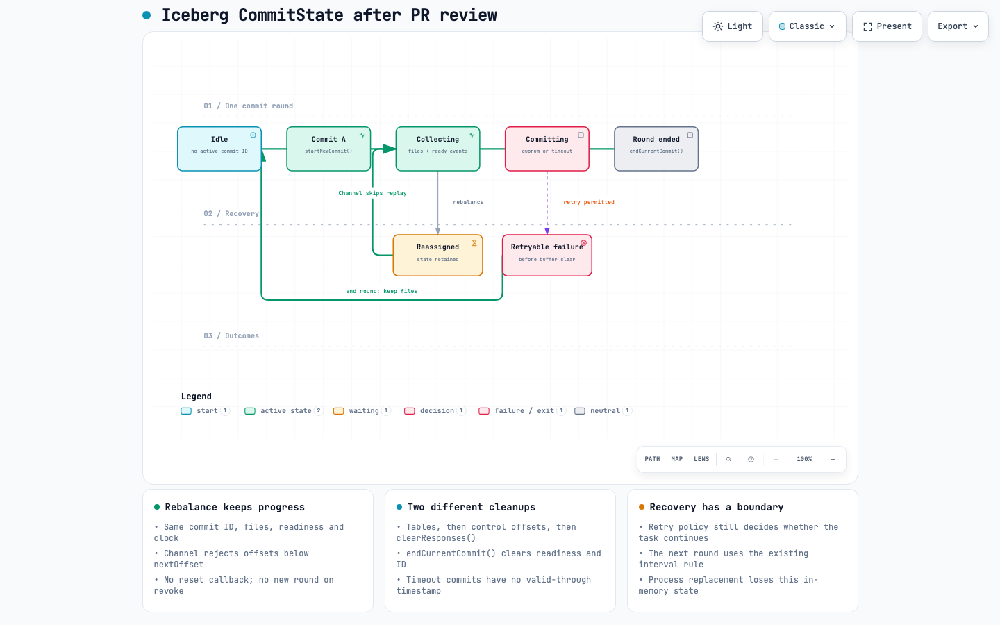

# Keep the Files, Skip the Replay: Iceberg's Kafka Connect Fix After Review

*A follow-up to [the original walkthrough](blog.md#L1) of [apache/iceberg#16282](https://github.com/apache/iceberg/issues/16282): what changed after reviewing the reset-based proposal in [PR #17925](https://github.com/apache/iceberg/pull/17925), and why the revised fix preserves state instead.*

By Nahid ([@nahidupa](https://github.com/nahidupa))

---

## TL;DR

The first proposed fix treated a control-topic rebalance as a reason to discard
the coordinator's in-flight commit state. Clear the files, clear the readiness
count, abandon the commit ID, and let Kafka replay the events.

That last part was the problem. **Kafka is not guaranteed to replay every
response that the reset discarded.** A surviving coordinator can be reassigned
without a committed control offset and resume at the log end. With multiple
control partitions, replay can also be incomplete when a timeout fires.

The revised fix changes the question. Instead of asking, "How do we rebuild
this state after a rebalance?", it asks:

> **Has this channel already consumed this control-topic partition and offset?**

If yes, skip the record before updating the offset map, decoding the event, or
dispatching it. Keep the buffered files and the genuine readiness responses
already collected.

That one decision prevents both offset regression and duplicate readiness
counting. The normal successful-commit cleanup stays in place.

This post describes the **local post-review implementation inspected on
2026-09-07**. It is not a claim that the revision has merged, that maintainers
have accepted it, or that every scenario reported in issue #16282 is solved.

---

## Part 1: First, what actually counts as a duplicate?

One detail in the original explanation needs tightening before we talk about
the fix.

**The same Parquet file appearing in two successive snapshots is normal.**

Suppose snapshot S1 contains file X. A later append adds Y. Snapshot S2 should
contain both X and Y. X appears in the history of both snapshots, but a query
against S2 does not scan S1 and then S2. It scans the live file set of its
selected snapshot.

The bad case is different:

1. S1 already contains X.
2. The writer mistakenly appends X again when constructing S2.
3. S2 now has two live entries pointing to the same file location.
4. An ordinary scan can read X twice and return its rows twice.

No second physical copy of the Parquet object is required. The mistake is in
the registrations, not the bytes.

### A short Iceberg refresher

An Iceberg table is not simply every file under a storage prefix. Its metadata
describes which files belong to each snapshot. Readers follow the selected
snapshot's manifest list and manifests to find those files.

An append writes new metadata and commits a new table state through the
catalog. The table commit is atomic, but that does not turn a submitted file
path into a globally unique key.

| Property | What it protects |
| --- | --- |
| Atomic table commit | Readers do not observe a half-published table update |
| Snapshot history | Readers can select an earlier table state |
| Writer-side replay handling | No extra append from an old response |
| Within-batch file deduplication | One submission per location in that batch |

These are different jobs. An atomic commit can still atomically publish the
wrong set of file entries.

**The connector needs to avoid submitting the duplicate. The table format is
not a substitute for that decision.**

---

## Part 2: The coordinator has more than one notion of progress

The Iceberg Kafka Connect sink has two conversations happening at once.

- **Source topics** carry the records that workers turn into data files.
- The **control topic** carries the messages used to coordinate table commits.

The coordinator starts a round with `StartCommit(commitId)`. Workers report
files with `DataWritten` and completion information with `DataComplete`. The
coordinator buffers those responses and commits when the expected source
assignments have reported, or attempts a partial commit after a timeout.

The important word is *buffers*. A worker can have written a file and announced
it before the coordinator has committed it to a table.

### Four values that are easy to confuse

| Value | Owner | What it means |
| --- | --- | --- |
| Consumer position | Kafka consumer | Next poll position |
| `controlTopicOffsets[partition]` | In-memory `Channel` | Accepted progress |
| Committed control offset | Kafka consumer group | Durable resume position |
| Snapshot offset summary | Iceberg metadata | Already-committed boundary |

The channel map stores one past the highest accepted control record offset
for each partition. The snapshot summary provides a boundary for filtering
file responses already accounted for by table commits.

The first two values can advance while a commit is still being assembled. The
coordinator commits its Kafka control offsets only after the per-table work
succeeds.

The snapshot summary uses a property named:

```text
kafka.connect.offsets.<control-topic>.<connect-group-id>
```

Its values are **next offsets**. A value of `5` means the boundary is before
record `5`, not after it. A response at offset `4` is below that boundary; one
at offset `5` is not.

The existing table-side filter reads that summary back and excludes
already-committed file responses. That remains necessary, particularly because
the table commit and the Kafka offset commit are not one shared atomic
transaction.

But the table-side filter cannot prevent a replayed readiness event from
corrupting the state of a round *before* the table commit happens.

---

## Part 3: How replay could damage a live commit

Before the guard, every consumed record performed this update:

```java
controlTopicOffsets.put(record.partition(), record.offset() + 1);
```

Then it could reach the coordinator's event handler. There was no check for
whether the same record had already been delivered to that channel.

Within a continuously advancing partition, the update looks harmless. After a
rewind, it is not.

### Two changes from one replayed record

Imagine the coordinator has buffered file responses through control offset
`7`, and its map is `{0: 8}`. An assignment change causes the consumer to
resume from an older committed position.

As the replayed prefix is consumed, two things can happen:

1. A plain `put()` replaces the higher map value with a lower one, such as `{0: 2}`.
2. A replayed `DataComplete` still carries the active commit ID, so it can
  increase the readiness count again.

The commit-ID check does not distinguish a genuine new completion from a
second delivery of an old completion for that same round.

Now the coordinator can think it is ready too early, while its file buffer
still contains responses from higher offsets than its map advertises.

### Why a lower boundary matters

Assume the previously stored table boundary does not already cover those
higher offsets. A premature commit can then include the buffered files while
recording an insufficient offset boundary in its snapshot summary.

Later, a response from that uncovered range can pass the table-side filter
even though its file was already appended.

That is the dangerous mismatch:

> **The snapshot contains work beyond the boundary it records for that work.**

The example explains the causal failure. It is not a claim that every
rebalance, every replay, or every crash produces duplicate rows. Existing
snapshot offsets and the order of events matter.

### Why the other checks are not enough

The coordinator already deduplicates file locations within a commit batch.
That cannot catch the same location submitted again in a later batch.

It also merges current offsets with previously committed table offsets using
`Long::max`. That preserves an existing higher table boundary; it does not
invent the higher boundary that a first affected commit should have recorded.

The missing check is earlier: **do not apply the same consumed control record
to the surviving channel twice.**

---

## Part 4: Why resetting looked right, and why it was unsafe

The original proposal added a revocation hook that effectively did this:

```java
clearResponses();
endCurrentCommit();
```

That cleared the file buffer, readiness state, and active commit ID. Old
readiness events would no longer match a live round, and the emptied file
buffer could not submit its old contents.

It addressed a real symptom. But its recovery argument depended on an assumption:

> Everything discarded from memory will be read again from Kafka.

The review of that argument exposed cases where it does not hold.

### Case 1: The first commit has not happened yet

Consider a fresh coordinator group:

1. A worker writes X and publishes its file response.
2. The coordinator consumes the response and buffers X.
3. A rebalance occurs before the group's first successful control-offset commit.
4. The surviving consumer is reassigned with no committed offset available.
5. Under the production default, `auto.offset.reset=latest`, it can resume at
  the log end.

X's response can still exist in Kafka without being delivered again from that
new starting position.

**If the reset discarded X, the coordinator no longer has the response it
needs to commit it.**

It cannot simply assume the worker will reread the source. The worker
publishes its control events and updates its source offsets in the same Kafka
producer transaction. Those source offsets may already have advanced.

Keeping X in the surviving coordinator allows a later commit attempt,
including a timeout commit, to include it without needing a second delivery.

### Case 2: Only part of the control topic replays

Now imagine buffered responses from two control partitions.

After a global reset, one partition might replay promptly while the other is
delayed. Or one partition might remain assigned and not rewind at all. A
timeout can arrive before the discarded state has been reconstructed.

The original reset also left the channel's offset map intact. That makes the
mismatch particularly important: progress for a partition can survive while
its file responses do not.

The problem is not just "wait a little longer for Kafka." The reset has
removed useful state without establishing that it can recover that state
before committing again.

### The change in approach

A rewound consumer position does not invalidate a file already written to
storage or a genuine readiness response already received.

**Retain those facts. Reject their duplicate deliveries.**

---

## Part 5: The revised fix runs before dispatch

The controlling change is inside `Channel.consumeAvailable()`, before the
existing offset update. Here is the guard and the update that follows it:

```java
Long nextOffset = controlTopicOffsets.get(record.partition());
if (nextOffset != null && record.offset() < nextOffset) {
  LOG.debug(
      "Skipping already-consumed control topic offset {} for partition {}",
      record.offset(),
      record.partition());
  return;
}

controlTopicOffsets.put(record.partition(), record.offset() + 1);
```

Source: [Channel.java](kafka-connect/kafka-connect/src/main/java/org/apache/iceberg/connect/channel/Channel.java#L124).

That `return` exits the `forEach` callback for **one record**. It does not stop
the poll loop. Later records can still be accepted.

### Why the comparison is `<`, not `<=`

After consuming offset `2`, the map stores `3`:

| Incoming offset | Decision | Map afterwards |
| --- | --- | --- |
| `1` | Skip: already below the boundary | `3` |
| `2` | Skip: already below the boundary | `3` |
| `3` | Accept: this is the next offset | `4` |

Using `<=` would discard the very next record the channel is supposed to
process.

The lookup is per control partition. Progress on partition `0` does not
suppress a lower-numbered offset on partition `1`. An unseen partition has no
boundary yet, so its first observed record is accepted.

### Why the location of the guard matters

It runs before all of these actions:

- Updating the consumed-offset map.
- Decoding the event.
- Checking the event's connect group.
- Calling `receive()` and mutating coordinator state.

For accepted records, the existing order remains: track the offset, decode,
then dispatch only events for this connect group. Records for another group
still advance the channel's position through the shared control log.

The guard therefore protects two properties at once:

**The map does not move backward, and a replayed readiness event does not
count again.**

### What was removed

The post-review implementation removes the PR-added rebalance listener,
coordinator reset hook, and `CommitState.reset()` method. `start()` uses the
ordinary subscription again.

That is intentional. This fix does not need a callback to announce every
rebalance. It checks each record at the boundary where applying a replay would
become harmful.

---

## Part 6: Walk through the fixed sequence


Interactive version: [Replay sequence](architecture/iceberg-16282-duplicate-files-fix-after-pr-review.html#L1).

For this example, there are **two source partitions**, P0 and P1, but only
**one control-topic partition**, `0`. The source assignments determine
readiness; the control offsets identify the delivered responses.

Commit A is active. The Kafka group's committed control offset is `1`. X and Y
are distinct files for the same existing table and UUID.

| Control delivery | Action | Next offset | Files | Ready for A |
| --- | --- | ---: | --- | ---: |
| `1`: `DataWritten(X)` | Accept | 2 | X | 0/2 |
| `2`: `DataComplete(P0, A)` | Accept | 3 | X | 1/2 |
| Rebalance, replay `1` | Skip | 3 | X | 1/2 |
| Replay `2` | Skip | 3 | X | 1/2 |
| `3`: `DataWritten(Y)` | Accept | 4 | X, Y | 1/2 |
| `4`: `DataComplete(P1, A)` | Accept | 5 | X, Y | 2/2 |

The replay does not complete the quorum. It does not create commit B. **The
genuine response from P1 completes the original commit A.**

On the successful path:

1. The table gets one new snapshot with X and Y once each.
2. Its control-offset summary is `{"0":5}`.
3. The coordinator commits Kafka control offset `5`.
4. It clears file responses and publishes `CommitComplete(A)`.
5. The `finally` block ends the round.

The sequence diagram compresses per-table work into one participant. Its
offset-commit arrow represents the Kafka consumer-group API, not another
control-topic record. It omits worker publishing, round setup, and the
separate `CommitToTable` notification.

### Check the next cycle too

The regression deliberately seeks back again after the successful commit.
Offsets `1` through `4` are all below the surviving channel boundary of `5`, so
none reaches the file buffer. A later timeout cycle adds no new snapshot for
them.

This second replay is an explicit test probe. It is not a claim that ordinary
reassignment would resume behind the now-committed offset `5`.

Checking only that the first replay produced no commit notification would be
weaker. The real outcome is that both expected files were committed, neither
was duplicated, and a later replay did not append them again.

---

## Part 7: Keeping state does not mean keeping it forever



Interactive version: [CommitState lifecycle](architecture/iceberg-commit-state-after-pr-review.html#L1).

The revised fix preserves `CommitState`'s existing distinction between **file
responses** and **round readiness**.

| State | What it holds | Cleanup |
| --- | --- | --- |
| `commitBuffer` | File-response envelopes | `clearResponses()` |
| `readyBuffer` | Completion events | `endCurrentCommit()` |
| `receivedPartitionCount` | Readiness count | `endCurrentCommit()` |
| `currentCommitId` | The active round's identity | `endCurrentCommit()` |
| `startTime` | Interval and timeout clock | Updated at round start |
| `controlTopicOffsets` | Per-partition progress | Independent of round cleanup |

The file buffer holds metadata, not Parquet bytes. Completion events support
timestamp calculation, while only matching-commit readiness increments the
assignment count.

A same-instance rebalance clears none of these. Replayed records cannot
increment the retained readiness count because they stop at the channel guard.

### Two cleanup boundaries, not one

The normal successful path has an important order:

```text
per-table work succeeds
  -> commit Kafka control offsets
  -> clearResponses()
  -> publish CommitComplete
  -> finally: endCurrentCommit()
```

`endCurrentCommit()` clears readiness and the active ID on every exit from the
commit attempt. It does not clear the file responses or reset the clock. A
later round still follows the existing interval rules.

If an attempt fails **before `clearResponses()`**, the files remain buffered
for another round when the existing retry policy allows continuation. That is
why the two buffers have different lifetimes.

But "every failed commit preserves the files" would be inaccurate. A failure
publishing `CommitComplete` happens **after** the file buffer has already been
cleared. Some exceptions and failure limits also terminate the task instead
of continuing.

A timeout uses the existing partial-commit path, which has no valid-through
timestamp. The replay guard does not change that policy either.

Source: [Coordinator.java](kafka-connect/kafka-connect/src/main/java/org/apache/iceberg/connect/channel/Coordinator.java#L154).

**In the diagram, "Round ended" means cleanup of the round. It does not mean
the commit succeeded.**

---

## Part 8: Test the recovery result, not the reset method

The revised tests replace reset-mechanics assertions with observable outcomes.

- `retainsBufferedFilesWhenRebalanceResetsToLatest`: A buffered file commits
  even when reassignment resumes at the log end and the response is not replayed.
- `commitsReplayedFilesExactlyOnce`: Replay cannot complete readiness early;
  genuine completion commits X and Y; later replay adds no extra snapshot.
- `retainsFilesDuringPartialControlReplay`: Both files survive incomplete
  replay across two control partitions, including a retained assignment.
- `ignoresReplayedOffsetsAndAcceptsNextOffset`: No duplicate dispatch or map
  regression; the record equal to the next offset is accepted.
- `tracksPartitionsIndependentlyAndFiltersOtherGroups`: Each partition has its
  own boundary and existing group filtering remains intact.

Sources: [TestCoordinator.java](kafka-connect/kafka-connect/src/test/java/org/apache/iceberg/connect/channel/TestCoordinator.java#L143) and [TestChannel.java](kafka-connect/kafka-connect/src/test/java/org/apache/iceberg/connect/channel/TestChannel.java#L43).

The coordinator tests inspect actual snapshots and file paths through the
existing in-memory catalog. They also check offset summaries and committed
control offsets. Counting `CommitToTable` notifications alone would not prove
that the right files survived recovery.

### Make the fixtures discriminate

Two small details matter in these tests:

- X and Y must have different file locations. Otherwise, within-batch
  deduplication can hide a missing-file problem.
- Both responses must identify the same table consistently, including its UUID.
  Mixing a missing UUID and an actual UUID can split the responses into separate
  table groups.

Those are fixture requirements, not production changes. Without them, a test
can look like a two-file recovery test while exercising something else.

### What was actually verified

The earlier implementation session recorded **139 passing tests across 19
suites**, along with the connector's formatting and main/test Checkstyle
checks. Removing the guard for a mutation check exposed duplicate dispatch and
premature readiness; restoring it made the focused checks pass.

These are `MockConsumer` tests, not a live Kafka broker reproduction.
Assignment changes and rewind positions are modeled explicitly; the mock
should not be treated as proof of all broker rebalance behavior.

The recorded verification command was:

```sh
./gradlew :iceberg-kafka-connect:iceberg-kafka-connect:test \
  :iceberg-kafka-connect:iceberg-kafka-connect:spotlessCheck \
  :iceberg-kafka-connect:iceberg-kafka-connect:checkstyleMain \
  :iceberg-kafka-connect:iceberg-kafka-connect:checkstyleTest --console=plain
```

The implementation evidence is recorded in [planning.md](planning.md). Java
tests were not rerun while writing this follow-up, and validating a diagram is
not an additional Java test result.

---

## Part 9: Why not just keep the maximum offset?

An obvious alternative is:

```java
controlTopicOffsets.merge(record.partition(), record.offset() + 1, Long::max);
```

That makes the map monotonic. It does **not** stop the next line of event
processing from applying the replay again.

| Approach | Map monotonic | Replay suppressed | Files retained |
| --- | --- | --- | --- |
| Original reset proposal | No | Abandons active ID | No |
| Maximum-only map update | Yes | No | Yes |
| Pre-dispatch replay guard | Yes | Yes | Yes |

The guard handles both consequences of the same duplicate delivery. That is
why the monotonic map update alone is not an equivalent fix.

Seeking forward on reassignment is another possible approach. It tries to
avoid receiving the old records. This implementation instead tolerates their
delivery and rejects them where they would mutate application state. It does
not add assignment-time seek logic or change the reset policy.

Related discussions include the replay-guard approach in [PR #17713](https://github.com/apache/iceberg/pull/17713) and the monotonic-map approach in [PR #17933](https://github.com/apache/iceberg/pull/17933). Consolidating related proposals is a separate publication decision, not something this local implementation settles.

---

## Part 10: The limits are part of the fix

**This is an in-memory, same-instance guard.** A new process does not inherit
the old channel's map or buffered responses. Durable restart recovery still
depends on the existing Kafka and table checkpoints; the no-checkpoint restart
case is not proven by retaining state in a surviving object.

**The identity is a control partition and offset.** If a producer republishes
the same logical message at a new offset, it is a new record to this guard.
This is not business-key deduplication or a global file-path uniqueness
constraint.

**It does not fence competing coordinators.** Leadership, stale coordinator
threads, and cross-instance conflicts remain separate concerns. Passing these
replay regressions does not establish correctness for all of those paths.

**It does not recover records lost to topic deletion or retention.** Skipping
an already-consumed record is not a replacement for durable input availability.

**It prevents this duplicate-append path; it does not repair an affected
table.** Existing duplicate live entries require separate investigation and
repair.

And one combination is specifically unsafe:

> **Do not clear the buffer on rebalance while retaining the new replay guard.
> The guard would suppress the records needed to reconstruct the state that
> was just discarded.**

Preservation and duplicate suppression are one design, not two independent
toggles.

---

## Part 11: Four things worth taking away

**1. Replay is not proof that existing state is invalid.** The file response
already accepted by a surviving coordinator can still be exactly the response
it needs. A reset must have a recovery argument, not just a cleanup argument.

**2. A monotonic counter does not make a handler idempotent.** Keeping the
maximum offset protects the number. Skipping before dispatch also protects
readiness and buffered event state.

**3. Every checkpoint needs a precise meaning.** Consumer position, in-memory
progress, Kafka group offsets, and table snapshot summaries are related but
distinct. Treating them as one "offset" hides the failure window.

**4. A recovery test must prove that useful work survived.** "No premature
commit happened" is only half the story. The other half is "both expected files
eventually committed, with the right boundary, and replay did not append them
again."

The original proposal made rebalance a reason to throw away a round. The
revised fix makes duplicate delivery a reason to skip a record.

**Keep the files. Keep the genuine readiness. Do not count the replay.**

---

## Appendix: Code and diagrams

### Code reference

These links point to the local post-review implementation, not the earlier
reset-based version.

| Location | What to read |
| --- | --- |
| [Channel.java](kafka-connect/kafka-connect/src/main/java/org/apache/iceberg/connect/channel/Channel.java#L119) | Polling, replay guard, and offset-before-dispatch ordering |
| [CommitState.java](kafka-connect/kafka-connect/src/main/java/org/apache/iceberg/connect/channel/CommitState.java#L40) | File buffer, readiness, commit ID, and separate cleanup methods |
| [Coordinator.java](kafka-connect/kafka-connect/src/main/java/org/apache/iceberg/connect/channel/Coordinator.java#L121) | Round processing, timeout commits, cleanup, and table-offset filtering |
| [KafkaClientFactory.java](kafka-connect/kafka-connect/src/main/java/org/apache/iceberg/connect/channel/KafkaClientFactory.java#L53) | Consumer defaults, including `auto.offset.reset=latest` |
| [TestCoordinator.java](kafka-connect/kafka-connect/src/test/java/org/apache/iceberg/connect/channel/TestCoordinator.java#L143) | No-replay, repeated-replay, and partial-replay recovery regressions |
| [TestChannel.java](kafka-connect/kafka-connect/src/test/java/org/apache/iceberg/connect/channel/TestChannel.java#L43) | Per-record and per-partition guard behavior |

### Interactive diagrams and detailed walkthroughs

| Resource | Focus |
| --- | --- |
| [Post-review replay sequence](architecture/iceberg-16282-duplicate-files-fix-after-pr-review.html#L1) | Offsets 1 through 4, replay suppression, and the successful commit |
| [Post-review CommitState lifecycle](architecture/iceberg-commit-state-after-pr-review.html#L1) | Retained rebalance state and the two cleanup boundaries |
| [Detailed replay explanation](architecture/iceberg-16282-duplicate-files-fix-after-pr-review.md#L1) | Numeric example, coverage, and scope |
| [Detailed state explanation](architecture/iceberg-commit-state-after-pr-review.md#L1) | State lifetimes, failure ordering, and recovery limits |

The earlier blog and reset-based diagrams remain historical artifacts. This
follow-up supersedes their explanation of the proposed fix, without replacing
those files.
