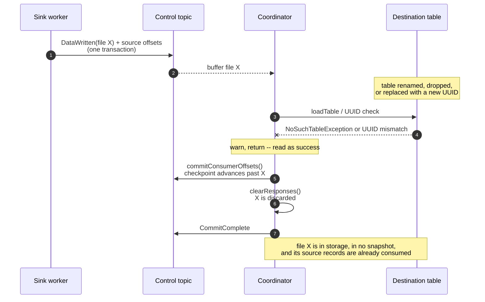
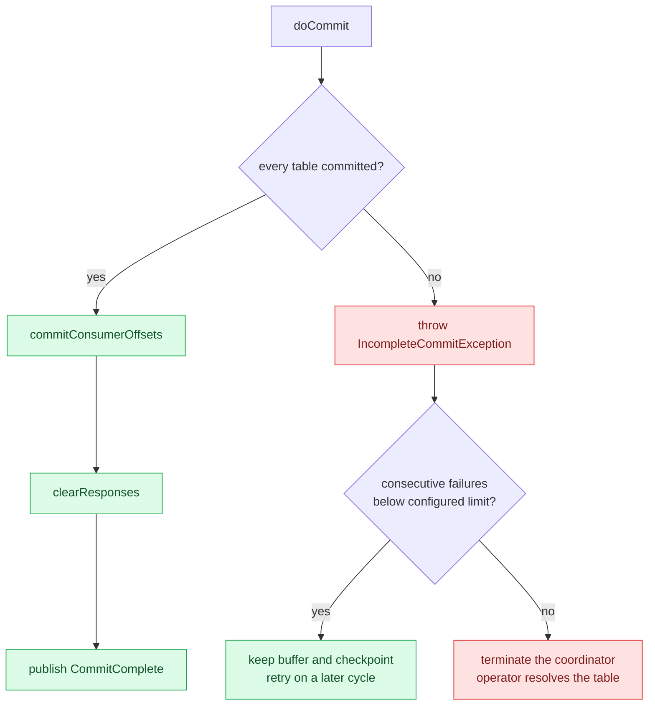
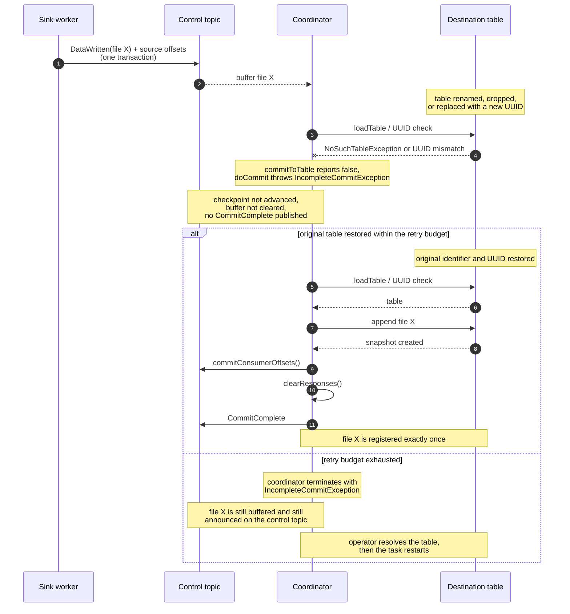

<!--
  Licensed to the Apache Software Foundation (ASF) under one
  or more contributor license agreements.  See the NOTICE file
  distributed with this work for additional information
  regarding copyright ownership.  The ASF licenses this file
  to you under the Apache License, Version 2.0 (the
  "License"); you may not use this file except in compliance
  with the License.  You may obtain a copy of the License at

    http://www.apache.org/licenses/LICENSE-2.0

  Unless required by applicable law or agreed to in writing,
  software distributed under the License is distributed on an
  "AS IS" BASIS, WITHOUT WARRANTIES OR CONDITIONS OF ANY
  KIND, either express or implied.  See the License for the
  specific language governing permissions and limitations
  under the License.
-->

<!--
Local PR preparation artifact; exclude this file from the code commit.
Branch: fix-connect-table-lookup-failures
Target: apache/iceberg main
Base revision: af86b8399ca794bfe482eae85ba7e79ab0c49adc
Intended scope: Coordinator.java, CommitState.java,
TestCoordinatorTableLookup.java, and docs/docs/kafka-connect.md.
-->

# Kafka Connect: Fail incomplete commits for missing or replaced tables

Archived September 8, 2026 PR draft. Test counts and mutation results below are
historical evidence, not validation of a later rebased head. This document is
fork-only and is not part of the upstream code PR.

## Problem

`doCommit` carried this comment:

```java
// we should only get here if all tables committed successfully...
commitConsumerOffsets();
commitState.clearResponses();
```

The comment was not true. `commitToTable` returned `void`, and two paths exited
early after only a warning:

```java
} catch (NoSuchTableException e) {
  LOG.warn("Table not found, skipping commit: {}", tableIdentifier, e);
  return;                                      // indistinguishable from success
}

if (tableReference.uuid() != null && !tableReference.uuid().equals(table.uuid())) {
  LOG.warn("Skipping commits to table {} due to target table mismatch. ...");
  return;                                      // indistinguishable from success
}
```

Because nothing propagated, the cycle advanced its control-topic checkpoint past
those responses, cleared them from the buffer, and published `CommitComplete` —
as though the files had been registered.

The worker had already published `DataWritten` and committed its source offsets
in a single Kafka transaction, so the input records are not redelivered. The
data files remain in object storage, referenced by no snapshot.



Restoring the original table afterwards does not recover the discarded response.

Retaining the batch and returning normally is not sufficient on its own.
Responses for an old and a new UUID under one table name can then block
completion indefinitely, even after both tables have received their own files.
Returning normally also resets the consecutive-failure counter despite the
incomplete cycle.

## Changes

- Report missing-table and UUID-mismatch outcomes to the enclosing commit.
- Raise a private `IncompleteCommitException` before checkpointing, buffer
  cleanup, or `CommitComplete` publication when any table remains unresolved.
- Reuse `iceberg.control.commit.max-consecutive-failures` for these failures in
  both full and timed-out partial commits. The existing default of `1` fails on
  the first incomplete attempt; higher values permit later-cycle retries.
- Preserve failure accounting until a full commit succeeds, and increment the
  partial-commit failure counter for incomplete partial attempts.
- Preserve UUID validation and per-table snapshot-offset deduplication.
- Document the retry policy and operational recovery constraints.



`IncompleteCommitException` extends `CommitFailedException` so that the existing
retry classification in `commit()` applies without a second code path. It is
private to `Coordinator` and is never thrown across a public boundary.

No new configuration property, dependency, or public API is introduced. Other
partial-commit exception handling is unchanged.

## Behavior and recovery

This deliberately changes missing/replaced-table handling from warn-and-discard
to bounded retry followed by coordinator failure. It does not silently discard
old-identity files, and it does not append them to a replacement table.

The same scenario as the first diagram, after the fix:



Neither branch discards file X, and neither writes it into a replacement table.

| Situation | Before | After |
| --- | --- | --- |
| Table briefly unavailable | checkpoint advances, response discarded | response retained, commits when the table returns |
| Table replaced with a new UUID | replacement protected, original file discarded | replacement protected, original file retained |
| Table permanently gone | silent data loss | bounded retries, then the coordinator fails loudly |
| Other tables in the same batch | committed | still committed, not rolled back |

Temporary unavailability recovers when the original identifier and UUID are
restored within the retry budget. Permanent deletion or replacement, and
buffered responses for multiple UUIDs under one name, require operator
intervention. Raising the retry limit cannot reconcile incompatible identities.

Successful Iceberg commits to other tables are not rolled back. Their buffered
responses stay until the batch completes; the existing snapshot-offset checks
prevent duplicate registration when those responses are retried, provided the
required snapshot history is still available.

The retry limit bounds failed attempts, not the bytes accumulated within an
attempt. The checkpoint is not advanced by an incomplete cycle, so recovery
after a task restart still depends on retained control-topic records and a
suitable consumer starting offset. This change does not alter offset-reset
policy, nor guarantee recovery once control records or deduplication history
have expired.

The initial missing-table behavior of dynamic routing is unchanged and remains
outside this change.

## Regression coverage

`TestCoordinatorTableLookup`, 12 tests covering default and configured limits,
same-UUID recovery, replacement protection, mixed-UUID termination, full and
partial retry accounting, failure-counter preservation and reset, and
deduplication when a healthy table's responses are retried. The mixed-table
cases run with two commit threads and assert file locations, Kafka checkpoints,
and completion-event behavior.

The suite is not vacuous. With the `IncompleteCommitException` throw removed —
restoring the old skip-and-checkpoint behavior — **11 of the 12 fail**; only the
healthy-table case still passes:

```
missingTableFailsAtDefaultRetryLimitWithoutCheckpointing()                    FAILED
missingTableRetainsResponsesAndCommitsThemWhenTheTableReturns()               FAILED
replacementTableIsProtectedAndTheOriginalFileIsCommittedWhenTheTableReturns() FAILED
mixedTableUUIDsFailWithinLimitEvenWhenBothFilesHaveCommitted()                FAILED
missingTableRetryDoesNotDuplicateHealthyTableFiles()                          FAILED
... 12 tests completed, 11 failed
```

## Validation

Validated on 2026-09-08 against base `af86b8399`:

- Full connector unit suite: **145 tests across 19 suites**, zero failures,
  errors, or skips.
- `spotlessCheck`, `checkstyleMain`, and `checkstyleTest` passed.
- `git diff --check` passed.

```sh
./gradlew -DsparkVersions= -DflinkVersions= -DkafkaVersions=3 \
  :iceberg-kafka-connect:iceberg-kafka-connect:check -x integrationTest --rerun-tasks
```

The tests use an in-memory Iceberg catalog and Kafka mock clients. No
real-broker integration test, coordinator-restart test, or heap stress test was
run.

---

<!-- markdownlint-disable-next-line MD036 -->
**AI Disclosure**

- Model: GPT-6 Astra (implementation, tests, and documentation); Claude Opus 5
  (audit that identified the defect, and review of this change).
- Platform/Tool: GitHub Copilot (implementation); opencode (audit and review).
- Human Oversight: partially reviewed.
- Prompt Summary: An AI audit of the Kafka Connect coordinator identified that
  missing-table and UUID-mismatch commits were checkpointed and discarded as if
  they had succeeded. A second agent implemented bounded-retry handling, the
  regression suite, and the documentation. The first agent then reviewed the
  result and verified the claims independently, including confirming the tests
  fail when the fix is reverted. Code, tests, and this description are
  AI-generated and partially reviewed by the author.
